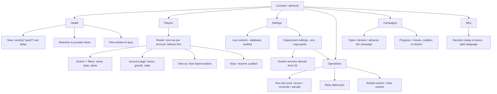

# The owner's console, v2 — information, not AI chatter, one place for every setting, and the operations a non-technical owner runs

Written 21 September 2026. Owner: UX and operability. This supersedes the
`owner-ui.md` verdicts that conflict with it — specifically the rejection of a config surface,
which the owner has since reversed. Read with [owner-ui.md](owner-ui.md),
[improvement-loop.md](improvement-loop.md), [budgets.md](budgets.md),
[cognition-gates.md](cognition-gates.md) and [product.md](product.md).

**Status: plan only.** Nothing here is implemented. The doc is a review of what ships today and
a design for the information architecture, the settings control surface, and the operation buttons
a server owner with limited technical knowledge needs. Owner decisions recorded 22 Sep 2026:
deployment configuration is **YAML in one file** (not JSON), and scalar settings that need no
restart are **database-backed through the host's `settings` table**. Slices at the end are the
handoff.

## The owner's asks, distilled

1. The console must be **informational** — it reads like a game operator's status board, not like
   developer logs. No "module is loaded and ready for development" chatter, no command names, no
   internal component names, no floats the owner did not ask to see.
2. The console must give **full control over the module's settings**, with a hard, visible split:
   what a staff member can change live (database) versus what only the server owner can change
   (environment / deployment).
3. Environment settings must **not be edited by hand in `.env`**. The UI provides the exact
   copy-paste value — and the apply instructions — for the server owner to apply on the server.
4. Deployment configuration is **centralised in one YAML file** — one file, copy-paste out —
   because many settings turn Docker services on and off, and scattered variables drift.
5. Every screen, toggle, input, select and label must **earn its place**. No decoration, no
   two-widgets-for-one-value, no label that only a module author understands.
6. The whole thing stays **OGame-like** — the host's ingame template and CSS classes, not a new
   framework.
7. The owner is assumed to have **limited technical knowledge** — no SSH, no artisan, no Docker
   fluency. Everything the owner does regularly is a button in the console; everything that cannot
   be a button ships as literal, numbered instructions the owner can follow without understanding
   the tooling.
8. The console carries the **operations**, not just the readings and settings: run the important
   module commands, retry failed jobs, restart the worker, clear caches — each as an audited,
   confirmation-gated action with its consequence stated before it runs.
9. Every knob and every operation has a **consistent definition**: what it does, why you would
   change it, what changes when it is off, and whether a restart is needed. The definition follows
   one fixed pattern everywhere (see "Definitions" below), so the owner learns it once.

## What ships today — reviewed screen by screen

The current page (`GET admin/ai`, `ai::index`) has five tabs. Here is the honest verdict on each,
before any redesign. "Value" is measured against the five questions in `owner-ui.md`: is it
working, is it playing well, which account, what does it cost, how do I slow it down.

| Surface | What it shows | Verdict |
| --- | --- | --- |
| Overview | switch, caps, today's counts, cost, actions, stop reasons | **Keep, reorder.** High value. The heading "Staff switch" and the welcome string are chatter; the rest answers Q1/Q4/Q5. |
| Pilot window | N-day report (work, provider, growth, cost) | **Keep.** Highest-evidence surface for Q2/Q4. Labels need de-jargon; the `pilot_note` paragraph is a developer justification the owner does not need. |
| Decisions | raw trace table: `Trace · player`, `Chosen`, `Decided by` (component name + float), `Ranked` (float) | **Demote.** This is a developer drill-down, not an owner answer. Component names and four-decimal scores are exactly the "bullshit text" the owner rejects. Move behind progressive disclosure as "Why did it do that?", relabel every column. |
| Monitoring | liveness, account switch, storage, providers, situation | **Split.** The account switch is a *control* (belongs with settings/controls); liveness/storage/providers are *health readings* (belong with Overview under one "Health" story). "Situation — the five review questions" leaks review-loop vocabulary (`measured`, `code-read`, `inferred`). |
| Accounts | authenticity figures + the progress board + drill-down | **Keep, sharpen.** The board is the single most valuable thing on the page (`owner-ui.md` OW-3). Alerts render raw machine strings; sort and labels need the plain-language pass. |
| Coalition campaign | `GET campaign` | **Out of scope here.** Owned by `PVE-002`; not part of the settings/console redesign. |

The recurring failure is one pattern, not five: **every figure is a truth, but almost every label
is a developer noun.** The data is good. The language is what reads as "AI chatter".

## Principles adopted — and where each came from

These are the community-standard interaction guidelines the redesign commits to. Each is cited so
a reviewer can check the design against the source rather than a taste.

1. **Progressive disclosure** (Nielsen Norman Group, "Progressive Disclosure"): the first screen
   answers the daily questions; rare or advanced material — decision traces, replay, per-lane
   provider internals — is one level deeper and clearly labelled so the owner knows what is behind
   the door before opening it. Two levels, never three.
2. **The right widget per semantic** (NN/g, "Checkboxes vs. Radio Buttons"): on/off is a checkbox
   or switch; exactly-one-of-N is radio buttons; several-of-N is checkboxes. Never a dropdown for
   two options, never a checkbox for a mutually exclusive choice.
3. **Precision beats a slider** (NN/g, "Input Controls for Parameters: Balancing Exploration and
   Precision with Sliders, Knobs, and Matrices"): numeric settings are a text/stepper field with
   the valid range and the default shown, because a slider cannot hit an exact value and gives no
   sense of range. Sliders are not used anywhere in this design.
4. **Positive, active labels** (NN/g, "Checkboxes vs. Radio Buttons"): a label states what turning
   it on does. "Generation replies enabled" is not "Do not disable replies".
5. **Sensible defaults first, customisation available** (NN/g, "The Power of Defaults" and
   sliders/knobs articles): the module ships safe, reviewed defaults so a new owner can run
   without touching anything, and every setting shows its default, its valid range, and a
   one-click "back to default" so an owner who customises can always return to the baseline. The
   console's job is to make the defaults obvious and the customisation safe — never to force a
   choice up front.
6. **One section = one action = one readonly DTO; the view queries nothing** (existing `owner-ui.md`
   rule): unchanged. The settings surface obeys it too — it renders one DTO of effective settings,
   it never reads a model or a file in the Blade.
7. **Read-only except the audited POSTs** (existing `owner-ui.md` rule): the only writes remain the
   switch, the account stop, and any DB-backed live control. Environment settings are never written
   by a web request — they are *composed* in the browser and *copied out*.

## Target information architecture

Six sections, ordered by how often the owner asks the question. Health and Players answer the
daily and weekly questions; Settings and Operations are the "before you go live / when you change
something" surfaces; Campaigns is the PvE operator mirror; Why is the advanced disclosure.



- **Health** — the situation dashboard: today's state, the monthly budget against its wall, the
  five-question situation, the authenticity panel, liveness/storage/providers, and the N-day pilot
  window with the growth curve.
- **Players** — a full roster with search and filters, three one-click row controls (View, View
  as, Stop / Resume), and the per-account drill-down.
- **Campaigns** — the PvE operator controls: open a campaign, declare strongholds, advance its
  state, and read progress and losses — the admin mirror of the player-facing coalition board.
- **Settings** — the full control surface, split into Live (database, host `settings` table) and
  Deployment (one YAML file).
- **Operations** — the buttons that run the module's commands and finish an env change, for an
  owner who never opens a shell.
- **Why** — the old Decisions tab, renamed and relabelled, plus scenario replay, behind progressive
  disclosure. Replay stays a GET; nothing here writes.

The tab bar itself is the host's `btn_blue` tabs — the same pattern the host's activity log uses.
No new navigation component.

## Health — the situation dashboard

The Health tab is the one place the owner reads "is it working, is it playing well, what does it
cost", reconciled with `verification-and-monitoring.md` (DEF-024). Every figure is a DTO read, no
view queries, under the read-cost discipline. It carries, in order:

1. **Now** — the switch state, population (profiles, in-flight sessions, due work), and today's
   action and stop-reason counters (the current Overview).
2. **Budget** — month-to-date spend against the monthly wall, per provider, with a "wall reached"
   flag, so a silently failing paid lane reads as a lane difference rather than a surprise bill
   (DEF-024 budget half).
3. **Situation** — the five review questions, relabelled in plain language and answered with a
   figure each: capability-chain stage, growth explicability, cohort divergence, reaction/save
   shape, and server aliveness. This is the standing review rendered (DEF-024 situation half), the
   same evidence `BuildAiSituationPanelAction` already computes.
4. **Do the accounts read like players?** — the authenticity panel (owner-ui OW-2): reactions
   inside the 120–180 s window, save outcomes (never a success rate), growth curve, and action
   breadth.
5. **Is anything about to run out?** — liveness (last activity, overdue accounts), storage and
   retention (oldest row vs its window), and provider lanes.
6. **The last N days** — the pilot window selector and `AiPilotReport` figures, including the
   server-rendered SVG growth curve the same report already computes (owner-ui OW-1).

The growth curve is a data rendering, so it stays server-rendered SVG — no chart library, survives
scripting off, and is the same `AiScoreReport` the CLI prints.

## Players — the full listing and per-account controls

The owner's most frequent account-level task is "find the account, see what it is doing, and act
on it." The Players section is one roster, not a board plus a separate control form.

**The listing** — one row per AI profile (enabled and stopped alike), ordered so a failure is first:

| Column | Source | Why it earns the width |
| --- | --- | --- |
| Player | `AiProfile.player_id` + host username | who this is, and the name the game shows |
| Archetype · skill band | `AiProfile` | how it is supposed to play |
| State | `AiProfile.enabled` | enabled / stopped at a glance |
| Last activity · next run | `AiSchedule` | is it alive, and when it is next due |
| Work | `ai_work_items` due / in flight / stuck | is it working |
| Window growth | the per-account delta `score()` already computes | is it growing |
| Last action · outcome | newest `ai_action_receipts` | what it just did |
| Alerts | zero growth, no action in window, save refused, stuck lease | why the row is on top |

Above the table: a **search box** (player name or id) and **filters** for state (all / enabled /
stopped) and for accounts with alerts — the two cuts an owner actually makes when the roster is
long. Sorting is by alert first, then staleness; the columns keep the existing read-cost discipline
(one indexed range per account, counters aggregated at write time).

**The row controls — three, all one click, all visible:**

1. **View** — the account page (`ai.account`), the drill-down that already exists: traces, growth,
   state. A GET, writes nothing.
2. **View as** — impersonate: POST the account's username to the host's existing
   `admin.developershortcuts.impersonate` route. No new controller and no session handling in the
   module: the host's `lab404/laravel-impersonate` takes and leaves, and the host menu already
   renders the "leave" link. This is the fastest answer to "is it playing well" — watch the game
   from inside the account.
3. **Stop / Resume** — the audited per-account switch (`SetAiAccountEnabledAction`), promoted from
   the buried monitoring form to a row action, still recording who, why and when. A stopped account
   keeps its memory, relationships and obligations; this is a stop, not a delete.

**Impersonation is labelled for inspection, with its honest caveat on the control.** While viewing
as an account, `Auth::user()` becomes the AI account and the console's own `admin` check stops
passing, so the console is unreachable until the host's leave link is used — exactly how the host's
own admin pages behave. The listing therefore shows the current impersonation state (the host's
`IngameMainComposer` already exposes it) and a "leave viewing" link beside it, and the switch is
named as the way to stop new work before a human drives the account by hand.

**"Run this account now" is a decision, not an assumption.** A per-account "kick one session" is a
small, useful control — but it is new machinery (a per-player dispatch), not something the module
already exposes, and it risks a human and the scheduler writing the same account at once. It is
listed as an open decision below rather than folded in silently.

## Campaigns — the PvE operator controls

Cooperative mode (human coalition vs the AI Empire) has no operator UI today: opening a campaign
and declaring strongholds require a hand-written PHP script against the actions, and the only
shipped page is the player-facing coalition board (`GET campaign`, owned by `PVE-002`). The console
therefore gains a Campaigns section, obeying the same rules as every other section: one DTO per
reading, audited queued jobs for every write, consequences stated before confirmation.

**The reading** — one DTO, the same figures the player-facing page shows but from the operator
side:

| Figure | Source | Question it answers |
| --- | --- | --- |
| Campaign state · window | `AiCampaign` | is one running, and until when |
| Objectives (strongholds) completed / declared | `AiCampaignObjective` | how close to the win |
| Faction momentum (ladder) | `AiCampaign` faction counter | is the faction racing to its own win |
| Coalition vs faction losses | contribution / battle records | is it going well or badly |

**The controls** — audited, queued, each mapping to an action that already exists:

| Control | Maps to | Why an owner clicks it |
| --- | --- | --- |
| Open a campaign | `OpenAiCampaignAction` (start, end) | start the next window; today it needs a PHP script |
| Declare a stronghold | `DeclareAiCampaignObjectiveAction` (campaign, planet) | name the objectives; today it needs a PHP script |
| Advance the campaign | `AdvanceAiCampaignStateAction` (`ai:advance-campaigns`) | move Preparing → Active, or resolve, now rather than waiting for the scheduled pass |
| Apply accounts to alliances | `AdvanceAiAllianceLifeAction` (`ai:advance-alliance-life`) | seed the coalition's AI side |
| Bond existing alliances | `BondExistingAllianceMembersAction` (`ai:bond-alliances`) | raise pre-existing alliance pairs to the friendship floor after a change |

The player-facing coalition board stays exactly where it is (`GET campaign`, any logged-in player);
this section is the operator's mirror of it, behind `admin`. Both render the same campaign DTO, so
the operator page and the player page cannot disagree about a campaign — the two-renderings
invariant again.

## Content rules — the non-AI voice

The same data, different words. These rules apply to every string in `lang/en/t_ai.php`.

| Rule | Example of what is removed |
| --- | --- |
| No developer narration | "The OGameX AI module is loaded and ready for development." → gone; the status line already says whether work is running |
| No command or class names | "rendered from that same answer — this page computes none of it" → gone |
| No internal component names in the default view | "Decided by: `FleetSaveAppetite: 0.42`" → "Why: fleetsave is cheap and the fleet is sitting" (or moved behind advanced disclosure, labelled "component weights") |
| No review-loop vocabulary | "Situation — the five review questions", `measured` / `code-read` / `inferred` → plain findings: "Last activity 3 min ago · 1 account overdue" |
| Machine strings get labels | board alerts `implode(', ', alerts)` → "No growth in 7 days", "Save refused", "Lease stuck" |
| Every heading is a question or a noun the owner would say | "Authenticity" → "Do the accounts read like players?"; "Liveness" → "Is it running right now?" |
| "AI" appears in the module title only | accounts are "accounts"/"players"; the board is "Players", not "AI players" |
| No shell knowledge required | the env apply steps are numbered instructions, and the console's own buttons (clear caches, restart worker) finish the job |
| No AI-generated or AI-translated copy | every string is authored by hand; no model writes, translates or localises UI text |

## Definitions — every knob and button explained the same way

One pattern, everywhere, so the owner learns it once and every control is self-explanatory. Each
knob, select, toggle and operation renders as a **definition card** with four fixed lines:

| Line | Answers | Example (conversation replies) |
| --- | --- | --- |
| **What it does** | one sentence, plain words | "The accounts answer pending messages from other players." |
| **Why you'd change it** | the situation that makes an owner touch it | "Turn off to stop replying while you investigate an account." |
| **When it is off / changed** | the concrete effect, no jargon | "Off = accounts read but never answer; memory and relationships are kept." |
| **Restart needed?** | yes / no / next minute | "No — picked up on the next session." |

The same card wraps every operation button, with the consequence in the "when it is off / changed"
line ("in-flight sessions finish first…"). The four lines are the only help text on the page; there
is no tooltip lore, no popover paragraph, no separate manual. If a definition cannot be written in
this form, the control is either unnecessary or not understood well enough to ship — which is the
definition's second job: it is the acceptance test for "does this knob earn its place".

This is also what makes the composer safe for a non-technical owner: the valid range and the
default sit next to the control (principle 5), and the card explains what moving the number does.
An owner should never have to know what a "token" is to set the reply-length cap — the card says
"the longest answer an account may write, in characters".

## Settings — the DB / YAML / code axis

The split is a rule, not a preference, and it is printed at the top of the Settings screen so an
owner can never mistake which kind of change they are making. Owner decision 22 Sep 2026: the axis
is three parts, and the test for which part a setting belongs to is one question — *does changing
it need a restart, a Docker change, or a secret?*

**Live settings — database, via the host's own `settings` table.** Anything a staff member tunes
during ordinary operation and that takes effect on the next read, with no restart and no Docker
change. Stored the way the host stores its own settings: `OGame\Models\Setting` and
`OGame\Services\SettingsService`, keyed `ai_*` to stay namespaced, read through typed accessors the
way `SettingsService::fleetSpeed()` reads `fleet_speed`. Defaults live in the accessor, exactly as
the host seeds its own.

1. Population switch — `AiOperabilitySwitch` (already ships; an audited append table, not a setting).
2. Per-account stop/resume — `AiProfile.enabled` (already ships).
3. The scalar guardrails moved here by this plan: population caps, language and consultation limits
   and timeouts, conversation TTL and toggle, affect/experience weights, review sampling, and the
   monthly cost wall — the full list is in the inventory below.

**Deployment settings — one YAML file.** Anything that selects a driver or Docker service, holds a
credential or endpoint, sizes a worker or lane, or is structured policy (ladders, windows, triggers,
pricing rates). These take effect after the owner saves the file and the console's own "clear
caches" / "restart worker" buttons run. The full list is in the inventory below.

**Code config — almost nothing left, on purpose.** The goal is that there is no third place an
owner has to know about. Whatever does not need to be live-editable and does not need deployment
wiring still lands in the YAML file (it is the module's single config source) rather than hiding in
a PHP file. Only a true compile-time constant stays in code.

The rule that assigns each setting, stated once so the inventory needs no per-row judgement:

- **Processes, services, endpoints, secrets, worker sizing, schedule cadence** → YAML (deployment).
- **Scalar guardrails read at runtime** (caps, limits, weights, toggles, TTLs, cost wall) → DB.
- **Structured policy** (ladders, windows, triggers, pricing tables) → YAML, because the host's
  settings table stores flat strings and a ladder serialised into a string is worse than the YAML
  it came from.

## The settings inventory

Every setting the module reads today, classified by the rule above. `Type` is the control the
composer uses per principle 2/3. `Class`: **yaml** (deployment, one file, copy-paste), **db** (live,
host `settings` table), **code** (compile-time constant — nearly none). "Env key today" names the
scattered variable this plan retires, so the migration can be checked row by row.

### Deployment — drivers, Docker services, worker sizing, schedule (YAML)

One setting selects the affect + social-cognition pair, because the two contracts share one
character state (`AiCognitionDriver`). The memory and experience drivers are independent selects.
These all change which process or service answers, so they live in the YAML file.

| Setting | Env key today | Type | Default | Class |
| --- | --- | --- | --- | --- |
| Cognition driver | `AI_COGNITION_DRIVER` | radio: native / fatima / psychsim | `fatima` | yaml |
| Cognition mode | `AI_COGNITION_MODE` | radio: native / external / hybrid | `hybrid` | yaml |
| Memory driver | `AI_MEMORY_DRIVER` | radio: native / agentos | `agentos` | yaml |
| Experience driver | `AI_EXPERIENCE_DRIVER` | radio: native / cbrkit | `cbrkit` | yaml |
| Fatima URL / connect / read timeouts / lock | `AI_COGNITION_FATIMA_*` | text + stepper | `…8092` / 2 / 5 / 10 s | yaml |
| CBRKit URL / timeouts / max cases | `AI_EXPERIENCE_CBRKIT_*` | text + stepper | `…8091` / 2 / 5 s / 200 | yaml |
| AgentOS URL / timeouts / max memories | `AI_MEMORY_AGENTOS_*` | text + stepper | `…8093` / 2 / 5 s / 50 | yaml |
| PsychSim URL / timeouts | `AI_COGNITION_PSYCHSIM_*` | text + stepper | `…8094` / 2 / 5 s | yaml |
| Circuit breaker failures / cooldown | `AI_COGNITION_CIRCUIT_*` | stepper | 3 / 60 s | yaml |
| Max driver response bytes | `AI_COGNITION_MAXIMUM_RESPONSE_BYTES` | stepper | 262 144 | yaml |
| Fatima scenario / path / instance / counterparty / exchange / ceilings | `AI_COGNITION_FATIMA_*` | text + stepper | see `config/cognition.php` | yaml |
| Horizon lane on/off | `AI_HORIZON_ENABLED` | checkbox | on | yaml |
| Worker/language memory, timeout, processes, balance, sleep | `AI_HORIZON_*` | stepper + select | see `config/horizon.php` | yaml |
| Reply provider + model | `AI_LANGUAGE_PROVIDER` / `AI_LANGUAGE_MODEL` | select + select | deepseek / deepseek-flash | yaml |
| Consultation provider + model | `AI_CAMPAIGN_CONSULTATION_PROVIDER` / `…_MODEL` | select + select | deepseek / deepseek-v4-pro | yaml |
| Universe scope (queue namespace) | `AI_LANGUAGE_UNIVERSE_SCOPE` | text | `default` | yaml |
| Session interval (schedule cadence) | `AI_POPULATION_SESSION_INTERVAL_SECONDS` | stepper | 0 | yaml |

Each driver row also shows its **Docker service state** derived from the same file — see the Docker
matrix below — so "driver = fatima" and "fatima service = up" are visible next to each other and
can never silently disagree.

### Deployment — structured policy (YAML)

Lists and tables, not scalars, so they stay in the YAML file rather than the host's flat `settings`
table.

| Setting | Source today | Type | Class |
| --- | --- | --- | --- |
| Provider routing on/off | `AI_ROUTING_ENABLED` | checkbox | yaml |
| Routing windows and ladders | `config/routing.php` | structured (edit in YAML) | yaml |
| Pricing rates, peak multiplier, currency | `config/pricing.php` | structured | yaml |
| Horizon wait thresholds (per queue) | `config/horizon.php` waits | structured | yaml |
| Consultation allowed triggers | `config/campaign-consultation.php` | checkboxes | yaml |
| Retention windows (per table) | prune action constants | structured | yaml |

### Live — scalar guardrails (DB, host `settings` table, `ai_*` keys)

Moved to the host's `settings` table with typed accessors; live, no restart. The audited switch and
per-account stop are separate append tables and are listed only to show the whole Live surface
together.

| Setting | Key today → new | Type | Default | Class |
| --- | --- | --- | --- | --- |
| Population switch | `AiOperabilitySwitch` | switch | — | db (audited) |
| Per-account stop/resume | `AiProfile.enabled` | switch | — | db (audited) |
| Profile cap / active-session cap / dispatch batch / session action cap | `AI_POPULATION_*` → `ai_population_*` | stepper | 0 / 0 / 100 / 1 | db |
| Language lane on/off | `AI_LANGUAGE_ENABLED` → `ai_language_enabled` | checkbox | on | db |
| AI-to-AI replies may reach provider | `AI_LANGUAGE_AI_TO_AI` → `ai_language_ai_to_ai` | checkbox | off | db |
| Provider timeout / reconciliation | `AI_LANGUAGE_TIMEOUT_SECONDS`, `AI_LANGUAGE_RECONCILIATION_MINUTES` → `ai_language_*` | stepper | 20 s / 30 min | db |
| Context / reply / token caps | `AI_LANGUAGE_*` → `ai_language_*` | stepper | see `config/language.php` | db |
| Language daily limits (universe / player / conversation) | `config/language.php` | stepper | see file | db |
| Conversation replies on/off | `AI_CONVERSATION_ENABLED` → `ai_conversation_enabled` | checkbox | on | db |
| Reply TTL | `AI_CONVERSATION_REPLY_TTL_MINUTES` → `ai_conversation_reply_ttl_minutes` | stepper | 180 | db |
| Affect enrichment on/off | `AI_AFFECT_ENRICHMENT` → `ai_affect_enrichment` | checkbox | on | db |
| Affect decision weight | `AI_AFFECT_DECISION_WEIGHT` → `ai_affect_decision_weight` | stepper | 10 | db |
| Experience decision weight | `AI_EXPERIENCE_DECISION_WEIGHT` → `ai_experience_decision_weight` | stepper | 20 | db |
| Review sampling on/off | `AI_REVIEW_ENABLED` → `ai_review_enabled` | checkbox | on | db |
| Monthly cost wall | `AI_MONTHLY_COST_USD` → `ai_monthly_cost_usd` | stepper (0 = off) | 10 | db |
| Campaign consultation mode | `AI_CAMPAIGN_CONSULTATION_MODE` → `ai_campaign_consultation_mode` | radio: off / observe / advice | off | db |
| Consultation caps, cooldowns, confidence, concurrency, reconciliation | `AI_CAMPAIGN_CONSULTATION_*` → `ai_campaign_consultation_*` | stepper + checkbox | see file | db |
| Consultation daily limits (universe / campaign / account) | `config/campaign-consultation.php` | stepper | see file | db |

## Centralised YAML — one file, copy-paste out

Seventy-plus scattered `AI_*` variables, undocumented in any `.env.example`, is the drift the owner
is describing. Owner decision 22 Sep 2026: the deployment half collapses to **one YAML file**, not
JSON. YAML is the right carrier here for three reasons, and the plan bakes all three in:

1. **Comments carry the definition.** YAML is the config format that lets the definition ride next
   to the value, so the generated file is self-documenting: every knob ships with its *what / why /
   effect* lines as YAML comments — the same definition cards the console shows.
2. **One file is a real file.** A single env variable forces a huge quoted, escaped blob into
   `.env`. A file is copied once and diffed cleanly — the owner pastes a file, not a line, which is
   what a non-technical owner can do without breaking it.
3. **No new dependency.** The host already ships `symfony/yaml` in its vendor tree; the module
   reads it the same way it already reads `OGame\…` classes.

The shape:

```yaml
# Modules/AI/ai-settings.yaml  (path overridable by AI_SETTINGS_FILE)
drivers:
  cognition: fatima        # which service appraises decisions (native | fatima | psychsim)
  mode: hybrid             # native | external | hybrid
  memory: agentos          # native | agentos
  experience: cbrkit       # native | cbrkit
language:
  provider: deepseek       # which paid lane answers a reply
  model: deepseek-flash
routing:
  enabled: false
  ladders:
    conversation_reply: [ { provider: deepseek, model: deepseek-flash } ]
pricing:
  rates:
    "deepseek.deepseek-flash": { input: 0.15, cached_input: 0.003, output: 0.60 }
horizon:
  supervisor-ai: { processes: 1, memory: 256, timeout: 30 }
```

The contract:

1. **One schema, declared once.** `Modules\AI\Support\AiSettings` (a typed value object) is the
   single schema. Every `config/ai.*.php` file becomes a thin reader of that one parsed object, so
   the eight config files stop duplicating `env()` calls and cannot disagree with each other.
2. **Boot validation.** The file is parsed with `symfony/yaml` and validated at container boot
   against the schema. A bad edit fails loudly with the key and the line number — never silently
   falls back. This is the trust boundary, and it is the one place validation is allowed to be
   strict.
3. **The YAML boolean trap is handled, not avoided.** YAML reads `on`, `off`, `yes`, `no` as
   booleans, and two real values collide with that: the consultation mode is literally `off`, and
   several toggles read `on`. The generator therefore **quotes every string value**
   (`mode: "off"`), and boot validation rejects a value whose parsed type does not match the
   schema — an unquoted `off` that parsed to boolean `false` reports "campaign.mode: expected
   string, got bool" with the line, instead of quietly changing the lane's behaviour.
4. **Back-compat shim for one release.** Any existing scattered `AI_*` variable still wins over
   the file for that one release, so an existing deployment upgrades without a settings migration.
   The shim is removed in the following release; the plan ships the removal note, not silently.
5. **Sensible defaults out of the box.** No file, or a missing key, resolves to today's behaviour
   exactly — the module's reviewed defaults (principle 5). The UI always shows the resolved value,
   so "not set" and "set to the default" read the same, and a fresh owner never has to write the
   file to run.

**The Docker wrinkle, resolved by derivation.** Docker Compose reads flat variables, not YAML, so
the service toggles need flat forms. The plan keeps one source of truth and *derives* the flat
forms: the Settings screen composes the one YAML and, from that same object, renders the derived
**service matrix** and the exact commands. The compose file's per-service `AI_*_BIND/PORT` variables
become values the derived block supplies; nothing is edited in the compose file by hand.

### The Docker services matrix

One small table on the Settings screen, derived from the composed block, one row per sidecar:

| Service | Compose name | Required by setting | Status implied by the block |
| --- | --- | --- | --- |
| Appraisal + social | `fatima` | cognition driver `fatima` (or `hybrid`) | up / not needed |
| Structured case recall | `cbrkit` | experience driver `cbrkit` | up / not needed |
| Ranked memory | `agentos` | memory driver `agentos` | up / not needed |
| Theory-of-mind stance | `psychsim` | cognition driver `psychsim` | up / not needed |

The apply output for the owner is exactly three copy-paste artifacts, generated from one object:

```
# 1. the file — save it at Modules/AI/ai-settings.yaml
drivers:
  cognition: fatima
  mode: hybrid
# … (the full file, with the definition comments)

# 2. one command to start the services the file implies
docker compose -f Modules/AI/docker/cognition/docker-compose.yml up -d fatima agentos

# 3. one command to stop the ones the file no longer needs
docker compose -f Modules/AI/docker/cognition/docker-compose.yml stop psychsim cbrkit
```

Plus, where a change needs it, a plain-language note naming the console buttons that finish the
job — "after saving the file, press Clear caches; if you changed a driver or a worker size, press
Restart the AI worker" — so the owner completes the change with buttons, not shell commands. Each
of the three blocks has a copy button; there is no form that POSTs the value.

### The composer itself

The Deployment panel is a client-side-only composer over the one YAML file:

- Each setting renders as its correct control (radio / checkbox / select / text / stepper) with the
  **current effective value**, the **default**, and the valid range beside it. An owner who never
  customises sees the defaults working and nothing more (principle 5).
- Editing updates the YAML live at the bottom; the YAML is always visible and always the authority
  — the controls are a convenience over it, never a second source.
- **Reset to default** per field and a **revert all** for the whole block (principle 5), so a
  customisation can always return to the safe, reviewed baseline.
- **Validate as you type** against the same schema the boot loader uses, so the file is known-good
  before it leaves the browser.
- A **diff against the running value**: changed keys highlighted, so an owner sees exactly what
  will move when they save.

No server round-trip is needed to compose; the one read the page makes is "what are the effective
settings now", from one DTO, under the existing read-cost discipline.

## Operations — the buttons a non-technical owner needs

An owner who cannot SSH still has to keep the module running, so the console carries a small, fixed
set of operations, one button each. Every operation follows the same discipline:

- **Mapped to something that already exists** — an artisan command, an action, or a host lifecycle
  endpoint. No operation invents a new mechanism.
- **Queued, never inline.** A click dispatches a module job on the existing AI lane; the request
  returns immediately. The page never runs a command synchronously inside a web request.
- **Audited.** Who ran it, when, and the result are recorded, exactly like the switch.
- **Confirmed with the consequence first.** The button states, in plain language, what is about to
  happen and what is affected, before it accepts the click. A restart says "in-flight sessions
  finish first; new work continues on the fresh process." A clear-cache says "the next few page
  loads are slower while the cache rebuilds; no accounts or game data are touched."

The fixed set, each with its mapping:

| Operation | Maps to | The owner's question it answers |
| --- | --- | --- |
| Run due work now | `ai:run-due-work` (idempotent: leases and enqueues) | "I turned the switch on / fixed something — kick a pass now" |
| Sweep old records now | `ai:prune` | "free disk now instead of waiting for tonight" |
| Settle provider charges now | `ai:reconcile-language-requests` | "close out a timed-out provider call now" |
| Sample scores now | `ai:record-score-samples` | "refresh the growth curve after a big change" |
| Restart the AI worker | host worker lifecycle / `horizon:terminate` (via the host's existing seam) | "the worker is running old code — load the new code" |
| Clear caches | host cache-clear lifecycle (`optimize:clear` equivalent) | "make a pasted setting live without a full redeploy" |
| Retry failed jobs | the AI lanes' failed jobs (one or all) | "a blip parked a job — push it again" |

Two of these are the bridge for the non-technical owner. The deployment change journey is one path,
not two: **change the block → copy the file → save it on the server → press "Clear caches" (and
"Restart the AI worker" when the change touched workers or drivers) in the console.** The console's
own buttons finish what the save started, so the owner never types `artisan` or `docker compose`.

The re-use rule applies before any of this is built. The host already carries Horizon (queue depth,
failed jobs, retries), `admin/server-administration`, and a lifecycle command surface; if the host
already exposes "clear cache" or "restart worker" behind admin, the module links to it and adds
only what the host cannot do — `run due work`, `prune`, `reconcile`, `sample`, and retrying the AI
lanes' own failed jobs. The restart and clear-cache rows are marked **reuse-if-present** for the
implementer to verify against the host first (decision 6).

Jobs that are not safe to run from a web click are not buttons. A full deploy, a migration, a
worker configuration change and anything that can interleave with a running session stays on the
server owner's side, and the apply instructions say so in words, not flags.

## OGame-style conformance

No new framework, no new design language. The Settings screen and the relabelled sections use the
host classes the page already extends (`ingame.layouts.main`, `group bborder`, `defaultTable`,
`btn_blue`, `box_highlight`, `fieldwrapper`/`styled`/`thefield` from `partials/metric.blade.php`).
Controls are plain HTML form elements styled by the host; a checkbox is a checkbox, a radio is a
radio — no JS-rebuilt widgets, so the semantic and the accessibility come for free and the page
works with scripting off (the existing progressive-enhancement rule). The one place the module's
own toolchain (`owner-ui.md` "Where Vite belongs") earns its keep is the settings **composer**
(copy button, live YAML diff, client-side validation) — it is progressive enhancement over a form,
and it is the first slice that actually needs module JavaScript.

## Slices — the handoff

Proposed codes; `doc_refs` is this file. Split so each slice is one action, one DTO, one view
section, one test — the `owner-ui.md` DX rule, applied to the new surface.

| Code | Kind | Title | Note |
| --- | --- | --- | --- |
| UX-001 | impl | The `AiSettings` YAML schema + `symfony/yaml` parse + boot validation + back-compat shim | one file, one schema; every config file becomes a reader of it |
| UX-002 | impl | `AiRuntimeSettings` accessors + move live scalars to the host `settings` table (`ai_*` keys) | the DB half; call sites read accessors instead of `config()` |
| UX-003 | impl | Effective-settings DTO + Settings screen (read-only, one DTO, no view queries) | renders current YAML + DB state, classified |
| UX-004 | impl | Settings composer — client-side edit, YAML authority, diff, reset, copy buttons | the module's first justified JS; progressive enhancement |
| UX-005 | impl | Docker services matrix + generated apply blocks (file, up/down commands, finish buttons) | derived from the composed file, never hand-written |
| UX-006 | impl | Copy/language pass — rewrite every `t_ai` string under the content rules, relabel Decisions → Why | removes the "AI chatter"; machine strings get labels |
| UX-007 | impl | Health section — merge Overview + liveness + storage + providers + pilot window under one story | reorders, does not recompute |
| UX-008 | doc  | Settings inventory + DB/YAML axis printed on the Settings screen | the tables above, rendered as help |
| UX-009 | doc  | Migration note — scattered `AI_*` removal after one release | records the shim's expiry |
| UX-010 | impl | Operations surface — run/prune/reconcile/sample/retry buttons as audited queued jobs | one action + one DTO per operation; the non-technical owner's toolbox |
| UX-011 | impl | Definition cards — the four-line pattern rendered for every knob and operation | the single source of "what does this do" |
| UX-012 | impl | Apply-now bridge — Clear caches + Restart worker buttons wired into the YAML-change journey | reuse the host endpoint if present (decision 6) |
| UX-013 | impl | Players roster — full listing, search + filters, row controls (View / View as / Stop-Resume) | impersonation posts to the host route; stop/resume stays audited |
| UX-014 | impl | Campaigns section — PvE operator controls (open / declare / advance) + progress and losses DTO | admin mirror of the player-facing board; same DTO both render |

Each `impl` slice carries a feature test: UX-001 asserts a bad YAML edit fails with the key and
line, and a valid file resolves; UX-002 asserts a changed `ai_*` setting is read on the next pass
without a restart and that call sites no longer read `config()` for it; UX-003 asserts the page's
settings equal the DTO and never query the DB for config; UX-004 asserts the composed YAML is
schema-valid; UX-005 asserts the up/down commands match the file's driver selections; UX-007
asserts the two-renderings invariant already required by `owner-ui.md`; UX-010 asserts each button
records who/when/result and runs through a queued job rather than inline; UX-011 asserts every
control has a definition card with all four lines; UX-012 asserts the apply journey's buttons map
to a host seam or a module job, never a raw shell call. UX-013 asserts the roster lists every
profile with search and filters, the View-as control posts to the host impersonate route, and
Stop/Resume records who/why/when. UX-014 asserts the Campaigns DTO equals the player-facing page's
figures, and that each control runs as a queued, audited job over the existing action.

## Gap analysis — everything this plan missed, and where each item lands

An audit against the module's actual surface (config, commands, actions, routes, specs, task DB)
and the other spec documents. Each row names the gap, the source that caught it, and its
disposition. **Closed** items are folded into the sections above; **decision** items are added to
the open list below; **excluded** items are deliberate and documented here so they are not
re-added by mistake.

| # | Gap | Source | Disposition |
| --- | --- | --- | --- |
| G1 | PvE operator controls had no UI — opening a campaign and declaring strongholds required a hand-written PHP script | owner report | **closed** — Campaigns section |
| G2 | The "situation dashboard" (budget + five-question situation) promised by `verification-and-monitoring.md` (DEF-024) was not reconciled with Health | cross-spec | **closed** — Health section |
| G3 | The authenticity panel (OW-2: reaction window, save outcomes, growth, breadth) was dropped in the rewrite | cross-check vs `owner-ui.md` | **closed** — Health section |
| G4 | The server-rendered SVG growth curve planned by OW-1 was not carried | cross-check vs `owner-ui.md` | **closed** — Health section |
| G5 | Driver/sidecar health — which engine answered, and whether an account degraded to native — has no surface and no recorded field | `owner-ui.md` deferred it; no task row exists | **deferred with trigger** — needs the attribution field on the hybrid rows first |
| G6 | `ai:bond-alliances` (bond existing alliance pairs) had no console control | command audit | **closed** — Campaigns controls |
| G7 | The codes `DEF-006`/`DEF-007` were reused for alliance-social tasks, so `owner-ui.md`'s "driver attribution" and "vite build" references dangle | task DB audit | **re-track** — give the two untracked pieces fresh codes (see G5) |
| G8 | `ai:cognition-conformance` / `ai:language-conformance` (verification runs) have no surface | command audit | **decision 12** — surface as audited Operations buttons or keep CLI-only |
| G9 | `ai:seed-test-universe` / `ai:seed-grand-test` are production-refusing by design | command audit | **excluded** — never a console button |
| G10 | `ai:explain-decision` needs no button — the Why tab renders the same action | command audit | **excluded** — the page is the surface |
| G11 | Pricing `peak_multiplier` / `currency` and Horizon `waits` were not named in the YAML structured-policy list | config audit | **closed** — structured-policy table |
| G12 | The host's own settings (universe mode, speeds) are edited on the host's admin page; the console should link, not duplicate | host audit | **decision 13** — link only |
| G13 | The review loop's human-feedback artifact (the operator-supplied pilot file) has no entry point | cross-spec vs `improvement-loop.md` | **decision 14** — add a "record feedback" field or keep it a file |
| G14 | OW-1…OW-7 already ship as `IMPL-051…057` (done) — the earlier "no task rows" note was wrong | task DB audit | **record corrected** — they are the baseline, not new slices |

## Gate check

- **Gate 1 — no static AI.** The settings surface derives nothing about the object universe. Driver
  names, modes and endpoints are deployment wiring, not game data; the object universe stays a host
  read.
- **Gate 2 — simplest mechanism.** One YAML file, one schema object, one DTO, one composer, one
  derived docker matrix, one operations table whose buttons are thin wrappers over commands and
  host seams that already exist. Live scalars reuse the host's `settings` table and
  `SettingsService` — no new settings table, no generic "config framework", no registry, no web
  form that writes env, no reimplementation of a host admin page. The composer and the operation
  buttons are the only client code, and only because copy-paste and safe one-click operations are
  the whole point of the surface.
- **Gate 3 — what a good player does.** The console is an operator tool; the naming test applies to
  its figures and settings. Every knob is nameable as an operator action ("turn the paid reply
  lane on", "raise the monthly ceiling", "swap the appraisal driver"), and every reading maps to
  something an experienced player's account would reveal.

## Decisions — resolved and still open

Resolved by the owner, 22 Sep 2026:

- **Deployment config carrier and format: YAML in one file.** Default path
  `Modules/AI/ai-settings.yaml`, overridable by `AI_SETTINGS_FILE`. Parsed with the host's
  `symfony/yaml`; string values always quoted so `on`/`off` cannot be read as booleans.
- **Restart-free, low-DevOps settings move to the database** through the host's `settings` table +
  `SettingsService`, keyed `ai_*`, read via typed accessors with defaults in code.

Still open — needed before implementation:

1. **File location and the apply story.** Default `Modules/AI/ai-settings.yaml` inside the checkout
   (recommended, copied into place on deploy), or a server-owned path outside the repo so an update
   never overwrites the owner's file. Decide which, and whether the owner saves the file themselves
   (SFTP/editor) or the console writes it (which reintroduces a server-side write — see 2).
2. **Can the console ever write the YAML file?** The design says no — compose-and-copy only. A
   "Save" button that applies directly is a server-side file write with permissions, locking and
   audit implications, and must be chosen explicitly if wanted.
3. **Audit on DB settings.** The host `settings` table has no who/when/why. Accept the host's plain
   model (recommended, `updated_at` only), or add a small audit for `ai_*` changes.
4. **Which structured policy goes in YAML now** — pricing rates, routing ladders, triggers and
   retention windows are proposed for the file; confirm none must stay code-only.
5. **Whether `Why` (Decisions) stays a tab** or collapses into the per-account drill-down only.
6. **Restart worker / clear caches — reuse or build.** Verify whether the host already exposes
   these behind admin; if it does, the module links and builds only `run due work`, `prune`,
   `reconcile`, `sample` and AI-lane retry.
7. **Console language** — English-only via `t_ai` (recommended), or honour the host locale system.
8. **Who uses the console** — host `admin` role (recommended), or a separate non-admin role.
9. **Campaign (PvE) scope** — operator controls (open / declare / advance) are now in scope as the
   Campaigns section; the player-facing coalition board (`GET campaign`) stays owned by `PVE-002`.
   Confirm the split.
10. **Branding** — keep "AI Players" as the nav title with "accounts/players" elsewhere
    (recommended), or rebrand the surface.
11. **"Run this account now"** — add a per-player "kick one session" control, or leave the
    population-level "Run due work now" as the only kick and keep the roster read-only except
    View / View as / Stop-Resume.
12. **Verification tooling surfacing** — surface `ai:cognition-conformance` and
    `ai:language-conformance` (and optionally the provocation harness `DEF-021`) as audited
    Operations buttons, or keep them CLI-only.
13. **Host settings link** — add a link in Settings to the host's own settings/admin page for
    universe-mode and game speeds, or leave the owner to find it.
14. **Operator feedback entry** — add a "record feedback" field to the console that appends to the
    review loop's feedback file, or keep feedback as a file outside the console.
