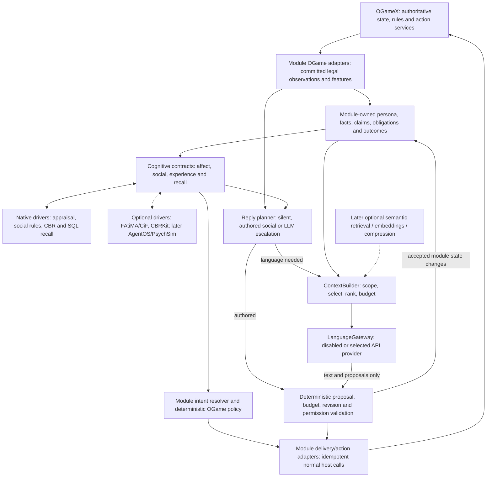

# Phase 3 — social cognition, experience and bounded conversation

Status: the deterministic pre-LLM baseline is complete, the optional 3H language slice is implemented and verified provider-off, slice 3I is implemented and measured against the pinned sidecars, and slices 3K and 3L are implemented with the provider still off by default. Both real drivers are opt-in behind module configuration with the native path as the default and the fallback; Gate 1 and the global A1–A8 gates are evidenced, and Gate 2 is unmet for both, so neither driver is enabled. Slice 3A is implemented: committed inbound direct chat for enabled AI recipients is recorded in module-owned `ai_observations`, retaining source references but never raw chat text. Slice 3B is implemented: typed fact/claim, sparse source-backed relationship and commitment lifecycle records, current-validity filtering and chat-source deletion redaction now include an after-commit alliance-membership reducer. It records only facts legally observable to enabled AI alliance members, preserves the join/leave source, closes prior truth and rejects rolled-back or stale callbacks. Slice 3C is implemented: its native `AffectEngine`, persisted deterministic decay, and source-deduplicated significant emotional episodes retain bounded affect without changing factual state or commitments. The affect engine now has a real caller: a committed battle report the AI took part in is reduced to an observation and appraised, with harm taken from the observer's share of the recorded resource loss. A participant that did not come off worse is observed but deliberately not appraised. Slice 3D is implemented: bounded typed greetings, thanks, help/resource requests, trade offers, ceasefires, apologies, warnings, cooperation and compensation retain exact terms, expiry and a two-message maximum protocol depth. Native authored replies use English seeded variants with a delivered-message repetition cooldown through the sealed host delivery ledger. Unsupported transport, enforcement and cooperation paths explicitly decline or clarify. Accepted compensation becomes an exact outstanding counterparty commitment, never a fulfillment. Slice 3E is implemented: queue admission remains an `Accepted` receipt, while only the real post-update `BuildingCompleted` host event can correlate its processed queue to one owner-scoped, source-provenanced successful building-upgrade case. Ambiguous, absent, incomplete, or mismatched historical receipt evidence retains no case. Native similarity remains deterministic and version-compatible. Slice 3F is implemented: module-owned replies coalesce only while pending, seal a stable delivery key/source range, recheck source and host permissions, and atomically retain the delivered host chat ID so retries cannot send twice. Slice 3G is implemented: it atomically reserves universe, account and conversation request/token capacity in module-owned daily ledgers, settles actual usage idempotently without enabling a provider, returns owner-scoped fact recall with source/evidence provenance, prioritizes intact protected context, and now has a two-process database contention fixture proving one shared cap cannot be exceeded. The final provider-off acceptance pass is verified with 138 Pest tests, 550 assertions, PAO, exact 100% PCOV and TIA. Disabled enrichment remains deferred. This specification incorporates the agreed direction from [خيارات ذاكرة الذكاء الاصطناعي](chatgpt-conversation://6aa3a38a-0a34-83e9-aae1-dc75ed9ac709). The [decision record](../DECISIONS.md) resolves changes of direction in that discussion. Package 2 is recorded at module commit `e1c48a2`; its deterministic sessions are the starting point, not evidence that FAtiMA, CBR or social memory already exist.

Start with the [current-state assessment](../research/phase-3-current-state.md) and [decision history](../DECISIONS.md#phase-3-decision-history--11-september-2026), then use [memory and language](memory-and-language.md), [budgets](budgets.md), [validation](validation.md) and [driver evaluation](../research/memory-comparison.md) for their specific contracts. All class names and records below are implementation targets. They must be reconciled with the actual schema before writing migrations.

Run container-backed Phase 3 work only through the host repository's `local-docker-dev/` environment; do not create or use a second OGameX Docker stack.

## Player outcome and scope

An AI remembers who helped or harmed it, distinguishes a claim from an observed fact, honors or explicitly renegotiates agreements, learns from actual outcomes, and responds in its own voice. A request from a trusted ally can produce a different social response from the same request by a past betrayer. Anger can sustain a grudge while normal game policy still favors recovery over an unsafe attack.

Phase 3 adds these capabilities inside `Modules/AI`:

- Native observations, beliefs, relationships, commitments, conversation state and experience cases.
- Goal-aware appraisal, emotions, social importance, coping intentions and bounded emotional autobiography, using FAtiMA concepts and a replaceable implementation.
- CiF-style social exchanges and authored dialogue, including state and consequences across multiple turns.
- Case-based reasoning (CBR): retrieve, reuse, revise and retain outcome-backed experience without a generative model.
- A conversation escalation policy, compact context and one bounded LLM request when unrestricted language is useful.
- Module-owned contracts, native/disabled defaults, bounded external-driver verification and an evaluation harness.

Implement a useful vertical slice at a time. Do not extract a package, create a universal game framework, add a driver marketplace, invent a second scheduler, or reorganize Phase 2 merely to make future extraction easier. No external provider becomes the player runtime.

## Responsibility and state ownership

| Concern | Owner | Boundary |
| --- | --- | --- |
| Game truth, rules, resource costs, combat and execution | Existing OGameX services | AI policies use only legally observable inputs; cognition cannot grant a forbidden action. |
| Persona, observations, accepted beliefs/claims, relationships, commitments, current cognition state | AI module tables | One authoritative module record, with revisions and provenance; drivers cannot independently evolve personality. |
| Meaning of an event to this character | Affect/social driver | Proposes appraisal, bounded state changes and high-level intentions; the module validates and persists them. |
| Social interaction and response stance | Social-exchange policy/driver | Uses relationship, goals, mood, obligations and dialogue state to accept, reject, counter, clarify or stay silent. |
| What worked in comparable situations | Experience driver | Returns cases, similarity, uncertainty and outcome evidence; the ordinary policy decides how much weight to give them. |
| Relevant older personal history | Long-term memory driver | Returns scoped source references and recollections; native records establish their current truth and visibility. |
| Natural-language expression or interpretation | Language gateway | Returns text and bounded proposals. No tools, database handles, fleet commands or independent state writes. |
| Mapping intentions to OGame candidates | Module OGame adapters and existing policies | Reuse existing capability, legality and receipt paths. Unsupported capabilities remain explicit no-ops. |

The mental-state questions remain distinct: affect describes how the player feels; social cognition describes its desired interaction; experience describes prior outcomes; recall supplies supporting history. Their outputs are combined by module actions, not by having external providers invoke or synchronize each other.

## Small contracts inside the module

Use `Modules\AI\Contracts`, existing Domain areas, `Actions`, `Support`, `Jobs`, `Listeners`, models and module migrations. Add `Domain/Cognition` and `Domain/Conversation` only for these concrete responsibilities. Bind defaults in the existing `AIServiceProvider`; resolve managed collaborators using `app()` / `app()->makeWith()`. Keep actions descriptive and single-purpose. Do not add forwarding-only methods or a generic `CognitiveKernel` / `DriverManager`.

| Contract | Concrete operation to define | Initial implementation and replaceable seam |
| --- | --- | --- |
| `AffectEngine` | `appraiseObservedEvent`: permitted stimulus + persona + goals + prior affect → proposed appraisal/state revision and intentions | Native baseline; FAtiMA driver is the first external compatibility target. A disabled implementation preserves baseline gameplay. |
| `SocialCognition` | `evaluateSocialExchange`: scoped exchange, relationship, affect, obligations and dialogue state → ranked social responses with reasons | Native authored exchange rules; evaluate FAtiMA/CiF together through the same external cognition session. |
| `ExperienceEngine` | `rankSimilarExperiences`: query and authorized versioned case features → ranked outcome evidence with similarity/uncertainty | Native structured similarity baseline; optional CBRKit adapter. Native module actions own retrieval/retention so the driver cannot become the canonical case database. |
| `LongTermMemory` | `recallRelevantMemories`: scoped query and source-validity constraints → bounded evidence/recollections | Native SQL retrieval first; AgentOS cognitive-memory subset is an optional later candidate. Add projection index/removal operations only with an enabled driver that needs them; native facts remain independent of the index. |
| `LanguageGateway` | `generateConversationReply`: bounded authorized context + approved purpose + budget reservation → typed response and usage | Disabled default; its first enabled implementation uses the first-party Laravel AI SDK with one configured provider/model. The SDK is transport only: no tools, conversation-memory authority or game actions. See [Laravel AI SDK integration](laravel-ai-sdk.md). |
| `ContextBuilder` | `buildConversationContext`: scope, snapshot and per-section budget → selected source references and serialized context | Deterministic selection, ranking and trimming; never a generative call. |

These six boundaries have concrete Phase 3 callers; they are not separate packages or independent network processes. Keep internal policy, case persistence and native fact-reduction actions concrete unless a real replacement requires another contract. Native facts and authored social behavior cannot be null implementations; the no-language path is a real `NullLanguageGateway`. Optional affect/experience enrichment can return a typed disabled result for baseline/ablation tests without deleting state.

Do not scaffold `TheoryOfMind`, `Embedder`, `SemanticRetriever` or `ContextCompressor` interfaces/jobs until an approved experiment supplies a caller. Their future operations are respectively bounded social-response prediction, versioned text embedding, scoped candidate-ID retrieval and fitting older prose to a remaining budget. Initially those features are disabled; deterministic context selection/trimming is inside `ContextBuilder`. When a real optional driver is introduced, add a disabled/null implementation and conformance tests at the same time.

Keep affect separate from social interaction because event appraisal also serves non-chat recovery, while exchanges own multi-turn protocols and obligations. Keep experience separate from long-term recall because numeric outcome similarity and prose/history relevance have different inputs, evidence and acceptance tests. Keep language separate from context selection because provider behavior is nondeterministic/costed while ACL selection must remain inspectable and deterministic. Shared payloads and native stores eliminate duplicate truth without merging these responsibilities into one all-purpose engine.

If FAtiMA supplies both affect and social cognition, a single adapter session must advance its integrated character state once per event. Do not run two independent RolePlayCharacter states behind the two contracts. Provider adapters add value by translating data, checking scope/version, enforcing limits and mapping failures; they are not forwarding wrappers.

Driver-neutral payloads contain actor references, persona, goals, stimuli, beliefs, relationships, exchanges, experiences, intentions, timestamps and evidence IDs. They do not contain `PlanetService`, an Eloquent model, a database connection or a provider SDK object. Domain types and result/failure categories use enums and immutable value objects where practical. Suggested result categories include completed, unavailable, timed out, invalid, stale and budget exhausted; never encode failure as a successful empty state mutation.

### No duplicated driver capability

An abstraction exists here so a driver can be replaced without rewriting module code, not so
the same capability can be implemented twice. Never implement a capability in PHP that a
supported driver already provides: do not port a driver's algorithm, do not write a second
implementation intended to match its output, and do not add a parallel "native equivalent"
purely to compare against. A .NET or Python service performs appraisal, social volition and
case retrieval better than PHP will, and a duplicate creates two authorities that can drift
apart while both appear correct.

The module's share around a driver is limited to what the module owns: scope, attribution,
permission, current-validity, validation, budgets, persistence, failure mapping and
translation between module payloads and the driver's wire format. Where a driver returns a
proposal or evidence, the ordinary module policy still decides how much weight it carries —
that weighting is module policy, not a second implementation of the driver. This is why a
driver substitution may legitimately change an appraisal, ranking or stance: the driver owns
that judgement, and the module never claims bit-identical output across different engines.

The existing native implementations remain the default and the fallback that an absent,
unconfigured or failed driver degrades to, because no baseline may depend on a sidecar. This
rule forbids **new** duplication; it does not ask for already-shipped fallbacks to be removed.
New driver work adds a contract implementation, a binding, bounded transport, conformance
and swap evidence — not a parallel algorithm.

### The OGame mapping remains concrete

`MapObservedGameEventToStimulusAction` translates a legally delivered battle loss into harm, responsibility, loss relative to the observer's assets, surprise and goal impact. It retains the exact report reference. The external driver sees an observed stimulus, not unrestricted battle tables.

`ExtractOGameExperienceFeaturesAction` derives bounded features such as observed power ratio, intel age, recent probe count, exposure, available support and recovery progress. Unknown enemy activity stays unknown. Feature definitions and their normalizers remain game-specific and versioned.

`ResolveCognitiveIntentAction` maps protect-self, seek-support, repair-relationship or retaliate intentions to existing OGame policy inputs/candidates. It must not create a universal executable `GameAction`. An intention to retaliate may lead to rebuilding or waiting; it does not authorize a fleet launch.

Read-only goal/belief projections supply progress, observed threat and available options to cognition. Where a driver supports computed beliefs, its adapter may expose allowlisted snapshot lookups, never arbitrary live database callbacks. Detailed build planning, fleet timing and resource math remain in their existing layers.

## Event-driven cognition

1. Observe an authorized, committed source and deduplicate it by scope, owner, source type and source ID.
2. Reduce it into typed facts/claims and determine whether it is emotionally significant, an experience outcome, a social exchange, or some combination.
3. Build a bounded revisioned snapshot and release the gameplay transaction/lock before any external work.
4. Ask only the relevant driver: routine construction does not need long-term recall or affect evaluation; a meaningful betrayal may need both.
5. Validate returned state changes against current source validity and the expected revision. Persist once, or discard/recompute stale results within a bounded retry policy.
6. Supply accepted intentions/evidence to the normal decision or reply planner. Revalidate at action/delivery time.

No periodic per-player cognition loop is added. Wake on legally observed meaningful events, messages, social decisions or completed outcomes. Deferred events are ordered by source time where available and the reducer's versioned ordering rule; late delivery must not silently replace newer truth.

The same source may yield distinct projections, such as an exact loss fact, an emotional episode and an outcome case. Record their shared source ID and different purposes. Do not copy the whole event stream into every provider. Recalling a belief is not a new observation, and private thoughts cannot become objective evidence through a provider feedback loop.

## Affect, goals and social importance

Preserve the useful integrated cognition concepts discussed in the conversation: goals, beliefs, appraisal, mood/emotions, social importance, emotional decision-making, coping, significant autobiography and dialogue state. Do not reduce the design to cosmetic emotion scores or assume that removing an integrated capability has no quality cost.

Appraisal considers goal desirability/obstruction, actor responsibility, predictability, perceived control, threat and relationship. Native calculations must name and version their scales, decay rules, limits and coefficients. Supply the clock and seeded randomness explicitly. The same event can create more fear for a cautious miner and more retaliatory intention for a vengeful fleeter while its factual content remains unchanged.

Persist affect and goal pressure separately from stable persona. Decay transient anger or distress with elapsed time; do not automatically forgive a debt or expire a valid commitment because an emotion fades. Keep only significant emotional episodes such as a costly betrayal, aid, a fulfilled/broken promise, expulsion or major loss. Their source facts remain independently retrievable.

FAtiMA is a candidate implementation of this capability, not an assertion that the native baseline reproduces the full toolkit. Compare the integrated driver against the baseline on actual behavior before selecting it. A failed compatibility spike must document the missing capability and fallback, rather than silently dropping it.

## Social exchanges and authored dialogue

Use explicit exchange types, preconditions, participants, terms, current step, allowed responses, expiry and accepted consequences. First cover greetings/thanks, resource/help requests, trade offers, ceasefire proposals, apologies, warnings/threats and cooperation requests. Later variants may reuse these primitives for alliance invitations, reminders, compensation and accusations of broken promises.

Each exchange evaluates trust, affinity, fear/threat, respect/social importance, relevant goals, unresolved obligations, previous interactions and available legal actions. A refusal, partial forgiveness or request for clarification is a valid outcome. Promises must have exact parties, terms and due conditions; an apology alone does not mark an obligation fulfilled.

Use authored lines with intent, tone, locale and allowed factual slots, seeded variant selection and repetition cooldowns. A known social exchange may be substantive and still need zero LLM calls. Deterministic recognition handles explicit structured messages and conservatively recognized language; ambiguous sarcasm, names, quantities or conditions must not be confidently guessed from a keyword.

AI-to-AI exchanges use typed messages and the same social rules. Render authored text only where a human can legitimately observe it. Bound exchange depth, pending proposals, retries and unsolicited traffic so automated agents cannot create an endless negotiation or public-chat loop.

## Experience learning without LLMs

Store a case as an observed situation, selected intention/action, ruleset/feature versions, actual outcome, uncertainty, utility components and supporting operation/report IDs. A decision without a completed outcome is pending, not a success. Failed and inconclusive attempts are retained when useful; avoid a success-only history.

1. **Retrieve:** filter by owner/authorized sharing, compatible ruleset, case family and feature version. Rank a bounded candidate set with named numeric/categorical similarity functions and missing-value handling.
2. **Reuse:** return evidence for existing options. Adapt only validated parameters within normal policy bounds; an old successful action cannot bypass today's resources, intel age or permissions.
3. **Revise:** correlate the real outcome with the decision/receipt. Separate predicted utility from realized benefit/loss and incomplete/confounded outcomes.
4. **Retain:** upsert once by source/outcome identity, update bounded statistics, and aggregate/archive repetitive cases with traceable provenance.

Personal experience is the default. Authored public seed cases and archetype-specific examples may be added as explicitly labeled knowledge with a ruleset/version; they must not expose other players' private histories. Do not secretly give every novice every veteran's experience. Compare novice/veteran and each persona with controlled cases.

Start with outcome families actually supported by durable sources and executable capabilities. Test social cooperation/trade outcomes and survival/recovery evidence as those paths become available; record-only fleet intents are not completed missions. Cold start, no close match, conflicting evidence or unavailable CBR returns control to the existing deterministic policy.

CBR contributes evidence when an interaction involves an actual decision. Greetings and routine acknowledgements do not retrieve cases. Generalized policy induction, executable skill generation and continuous model-based reflection are deferred research, not part of CBR's Phase 3 runtime.

## Conversation escalation

The reply planner chooses a typed route before reserving model capacity:

| Route | Situation | Generative requests |
| --- | --- | --- |
| Silent | Ignored/rate-limited sender, expired message, no useful response or insufficient confidence | 0 |
| Template | Greeting, acknowledgement or routine system-like response | 0 |
| Authored social dialogue | Known exchange; cognition selects stance and an adequate authored variant | 0 |
| LLM realization | Intent and permitted facts are settled; varied human-facing wording adds value | At most one bounded foreground request |
| LLM interpretation/reply | Ambiguous free-form human language needs interpretation and a proposed reply | At most one bounded foreground request, including any extraction |

For the ambiguous route, provide current cognition and allowed response constraints; the model proposes an interpretation, text and optional fact/commitment candidates together. Re-evaluate the interpreted exchange deterministically afterward. If the returned wording would promise something the validator rejects, replace it with an authored clarification/refusal or remain silent. Do not use an interpretation call followed by a second realization call to finish the same turn.

The complete receipt, context, delivery and coalescing contract is in [memory and language](memory-and-language.md). Budget limits and the distinction between coalescing, background work and provider Batch APIs are in [budgets](budgets.md).

## External drivers and ordinary Linux servers

Use the existing Laravel queue/database/container as the application runtime. An external driver may be a bounded headless sidecar owned and configured by the module. Do not spawn one process per AI player, require a GUI, or assume GPU/Kubernetes/vector infrastructure is needed for the native baseline.

The first compatibility targets are FAtiMA/CiF for integrated character cognition and CBRKit for structured experience. AgentOS is the selected candidate for richer long-term recall when needed; use only its memory services. PsychSim is later, bounded Theory of Mind. Exact project identities, pinned versions, licenses, supported runtime/API and deployment requirements must be verified from primary sources in the spike; claims in the imported chat are not verified installation results.

For every enabled driver: define connect/request timeouts, payload/candidate limits, concurrency cap, health checks, circuit breaker, revision/idempotency handling and a tested native/disabled fallback. Do not keep player-specific mutable state in an unscoped Laravel singleton. External state changes must be idempotent or recoverable; no retry may reapply the same appraisal as a new experience.

Export canonical state with module IDs/schema versions. Rebuild disposable indexes from authorized projections. Swapping a driver must not reset persona, trust, active agreements or history. If an external cognitive checkpoint cannot be translated, rebuild from a compatible module snapshot and record the capability/behavior change; never claim bit-identical behavior across different engines.

Run compatibility work as one focused spike per selected driver, not another broad product search. Pass: a pinned headless Linux implementation completes a realistic contract scenario and outage/swap test. Fail: record the exact blocker, retain the tested baseline and leave that driver disabled. Report feature gaps honestly. No package or host dependency is added by this planning revision.

### Configuration and state lifetimes

Keep driver configuration in the module: selected affect/social/experience/memory/language implementations, enabled capabilities, timeouts, bounded payload/history sizes, queue concurrency, feature versions and experiment cohort. Secrets remain environment configuration, never persona settings or traces. Default to native cognition/social/experience/memory and disabled language; explicit operator configuration enables one language provider. Optional embeddings, ML compression, Theory of Mind, advanced memory and strategic advice start disabled.

Validate supported driver combinations at boot without eagerly connecting to absent optional sidecars. An unknown/misconfigured enabled driver must produce a visible configuration failure and defined native/disabled fallback. Record the selected configuration and revisions in experiment traces. Changing a driver must invalidate incompatible cached projections/checkpoints while preserving canonical facts, persona and obligations.

Module-owned data is durable: exact observations/claims, persona, accepted affect/social state, commitments, case outcomes, message source IDs and usage receipts. A cognition driver may keep an implementation-specific checkpoint as a versioned projection for performance; an experience driver may cache a case index; long-term memory may cache/index approved episodes. Conversation bodies remain in the host's normal chat storage where available, with module-owned ACL/revision/proposal metadata. Avoid a second unbounded raw-message archive.

### Failure and degradation contract

| Failure | Degradation | State and retry behavior |
| --- | --- | --- |
| FAtiMA/affect-social sidecar unavailable | Use native affect/social rules and authored dialogue; normal recovery/utility policy proceeds | Use canonical module state; reject partial or stale external updates. Record degraded mode and bounded circuit-breaker recovery. Do not reset emotion/persona or apply the same appraisal twice. |
| AgentOS/advanced recall unavailable | Use native scoped facts, obligations and recent/significant episodes | Projection work may retry in bounded outbox jobs; no private-state dump into the LLM as compensation. |
| CBRKit/experience driver unavailable | Use native structured similarity where configured, otherwise existing utility policy with no experience bonus | Retain finalized real cases locally for later indexing. Missing advice is not a failed gameplay action. |
| Embeddings/index unavailable | Entity/time/full-text/native retrieval | Mark projection version pending; do not mix vector spaces or trigger an unbudgeted hosted model. |
| LLM unavailable, invalid, over budget or too slow | Authored response, bounded clarification, defer within TTL or silence | Keep ordinary gameplay and structured exchanges running. Account for every attempted request; uncertain calls require reconciliation before retry. |
| Optional compression/ToM unavailable | Deterministic context trimming / baseline social evaluation | No mandatory enrichment or second LLM fallback. |
| Canonical database unavailable | Ordinary database/job failure handling; defer state-dependent work | Native truth cannot be fabricated. Provider fallback does not solve lost authoritative storage; report and retry safely when it returns. |

## Eight end-to-end flows

Generative counts below describe the normal request path. A transport retry is a separately recorded attempt under the shared cap; it is never an extra reasoning/extraction stage. In every flow, deterministic module policy authorizes social/behavioral consequences and only existing OGameX domain services can execute an actual game action.

### 1. Routine human greeting

Receive/reload authorized chat → deduplicate/rate limit → recognize greeting → choose a seeded authored variant → permission recheck → normal chat send. LLM calls: **0**. Persist source/conversation position and a delivery receipt; create a relationship only if policy considers this meaningful contact. No fleet/resource action occurs.

### 2. Structured trade proposal

Read explicit parties, quantities, units and deadline → consult current permitted resources, relationship, obligations and optional relevant outcome cases → social policy chooses reject, counter or an authorized proposal → authored response. LLM calls: **0**. Persist the exchange, exact proposed/accepted terms and source; fulfillment is recorded only from a real correlated transport/outcome. If no validated executable trade/transport adapter exists, do not promise a completed delivery: record unsupported capability and decline or clarify. Adding any needed narrow module adapter first requires human-path equivalence tests; the social engine never creates fleets.

### 3. Apology after prior betrayal

Recognize the known apology → native recall loads the betrayal and any later successful trades with source IDs → affect/social cognition weighs current anger, trust, goals and obligation state → accept, partially forgive, request compensation or reject → authored text. LLM calls: **0** for a confidently recognized exchange; richer wording may independently choose the realization route with **1** bounded call. Persist the apology, accepted relationship/appraisal changes and exchange result. Do not delete the betrayal or mark a debt fulfilled merely because an apology was accepted.

### 4. Complicated free-form human negotiation

“Leave your alliance before reset and I will arrange protection until Sunday if you pay half your production” → ambiguous route → scoped context with current cognition, exact known obligations and permitted choices → **1** combined interpretation/reply request → deterministic validation of proposed conditions, actors and intent → send only compatible text, otherwise authored clarification. Persist attributed claims and validated proposals; no raw trust delta or promise is automatically applied. Existing policy must approve any later commitment/action, and an unsupported alliance/transport capability cannot be invented by the reply.

### 5. AI-to-AI social interaction

One AI sends a typed help/cooperation proposal → recipient's social policy evaluates trust, goals, obligations and relevant experience → typed accept/reject/counter response with bounded protocol depth. LLM calls: **0**, including any public rendering. Persist exchange/commitment transitions and authorized social evidence once. Authored text may be sent through normal chat when a human may see it. Any actual assistance still uses an existing validated OGame action adapter.

### 6. Major fleet loss

AI legally receives a committed correlated battle report → native reducer records the loss → appraisal updates distress/fear/anger and goal pressure → finalized outcome updates CBR → existing utility policy chooses available recovery/safety behavior. Baseline LLM calls: **0**. A later explicitly enabled rare-advice experiment may make **1** separately budgeted advisory request without delaying recovery; it cannot dispatch a fleet. Persist the exact fact, significant emotional episode, outcome case and accepted intentions, all linked to the same source. A record-only fleet intent is never used as proof that a battle happened.

### 7. Retrieve an old human-conversation memory

Human refers to an old encounter → exact entity/time/fact retrieval first → if an enabled, benchmark-qualified advanced memory/semantic driver is relevant, request bounded candidate IDs → recheck native visibility, deletion, source attribution and current validity → select a few records for context. Retrieval uses **0 generative calls**; optional embeddings are metered separately. Authored output uses **0**, while unrestricted reply generation uses **1**. A recalled claim remains attributed and does not create a new fact merely by being retrieved. Only conversation/delivery metadata or explicitly bounded retention bookkeeping is written.

### 8. LLM provider failure

The planner reserves a request → provider attempt fails or returns invalid output → record actual/uncertain usage and failure → choose authored clarification, defer-with-expiry or silence → continue scheduled gameplay independently. Generative attempts: **1** if dispatched, **0** if the circuit breaker/cap refused dispatch. A safe retry, if allowed, is one further counted attempt and cannot bypass the global cap. Persist the request/usage state and any delivered fallback receipt; do not persist unvalidated model proposals or clear memory. No game action depends on the provider succeeding.

## Later capabilities and explicit activation gates

| Capability | Placement and condition |
| --- | --- |
| AgentOS enhanced recall | Optional Phase 3 follow-on/Phase 4 experiment after native retrieval measurements. Gate 1 passes and the driver is already implemented but disabled; **Gate 2 is unmet**, so it stays off until held-out outcomes show ≥5 pp recall gain or ≥20 % lower cost at comparable quality (see the [driver acceptance criteria](../research/phase-3-driver-acceptance.md)). No agent runtime, tools, autonomous personality, LLM extraction/derive/reflection/HyDE. Verify zero generative requests for the chosen memory configuration. |
| Semantic embeddings | Enable for long conversational prose only after measured native retrieval misses, and only with a caller and an approved experiment — stage 3 of the [retrieval ladder](../research/phase-3-driver-decisions.md). **Hosted OpenAI embeddings behind the module's `Embedder` contract, pinned to a dated snapshot**; a local embedder is excluded by the owner's standing rule and the 2 vCPU / 2 GB reference profile, and the storage form is still open. Scope/filter results against canonical facts. |
| ML prompt compression | Consider only after selection, section budgets and semantic selection prove insufficient. Only older prose is eligible; instructions, current turn, exact terms and provenance remain intact. |
| PsychSim | Optional advanced diplomacy/coalition reasoning after baseline social quality is measured. Start with self plus 1–3 counterparts, depth 1, at most depth 2 only after profiling, a small choice set and a hard deadline. No per-tick invocation. |
| Rare strategic LLM advice | Optional post-baseline Phase 3+ experiment, disabled by default. Eligible major events: fleet loss, war declaration, repeated attacks, alliance conflict, new colony or major rank change. Trigger alone is insufficient: require a material unresolved decision, event dedupe, cooldown and an explicit budget. Existing policy responds immediately; validated advice may influence later planning only. |
| Deferred provider batches / learning summaries | Preserve as a future experiment for explicitly selected meaningful conversation episodes or outcome clusters. Idle time or 50 accumulated cases does not itself authorize an LLM call. No automatic per-event summarization or periodic reflection. See the opt-in gate in [budgets](budgets.md). |
| Framework extraction / community drivers | Revisit only after a real implementation swap works without changing OGame domain code and contracts remain stable in use. A second real consumer would strengthen the evidence. No package split or generic game integration layer in Phase 3. |

Phase 5 reuses accepted persona, social, experience and language boundaries for faction cooperation. It does not add a second AI brain or unlock AI-to-AI LLM chatter.

## Delivery slices and completion evidence

### Pre-LLM execution order (complete)

Every slice of the deterministic pre-LLM baseline is implemented and committed, in the
dependency order this section originally set. A slice is not treated as implemented because its
records or interfaces exist; each carries the proof named in the table below. Nothing here is
deferred to 3J, which owns the scenario/ablation harness, the export/delete acceptance tests and
the capacity measurements.

1. **Completed — 3F's deterministic delivery substrate.** Module-owned pending replies, authorized conversation/source ranges, sealing/coalescing rules, stable delivery keys, persisted host chat-message receipts and stale-source/permission reconciliation. Direct sending is only the final adapter, so every authored social response has a durable, idempotent delivery boundary.
2. **Completed — 3G's concurrent-cap proof.** The provider-off ledger, context and recall baseline plus a true concurrent database contention fixture against the same cap, so a later request-dispatch path can rely on it. No language/provider work is enabled in this step.
3. **Completed — 3D on the delivery substrate.** Explicit typed exchanges with deterministic terms, bounded state/depth and authored zero-LLM replies. Greetings, thanks, help/resource requests, trade offers, ceasefires, apologies, warnings and cooperation requests may decline or clarify unsupported capabilities; they never imply a transport, ceasefire enforcement, fleet action or fulfilled obligation. Compensation requires an explicit commitment direction and exact due terms, and remains outstanding until independent correlated evidence fulfills it.
4. **Completed — 3E from a durable completed host outcome.** A specific ordinary OGameX operation whose completion is correlated after commit. An `AiActionReceipt` that only says a building queue was accepted is not a completed building outcome and cannot produce a successful experience case. Pending, failed and inconclusive cases keep their source and receipt provenance, and a case is retained only once the outcome is final.
5. **Completed — authorized 3H language slice.** The provider-off baseline passed with Pint, Rector dry-run, module PHPStan, parallel Pest with PAO, exact 100% PCOV and TIA before the provider path was added. `LanguageGateway` now has the pinned `laravel/ai` 0.8.1 adapter, a typed disabled default, one combined structured prompt, validated proposals, an explicit receipt/settlement lifecycle, failure reconciliation and the opt-in sanitized `ai:language-conformance` run. The operator-run half is done as well: on 14 September 2026 `--corpus --confirm` ran all four sanitized cases against `deepseek-flash` and matched every expected interpretation, including refusing the prompt-injection case, for about a tenth of a cent; the artifact and its numbers are in [DECISIONS.md](../DECISIONS.md). No CI run contacts a provider.

This ordering is intentional: delivery receipts establish social-message reality; protocol commitments require that boundary; learning requires an independently durable outcome rather than a chosen intent or accepted queue; budget contention is proved before any later dispatcher can rely on it.

| Slice | Concrete deliverable | Required proof before moving on |
| --- | --- | --- |
| 3A — source audit and observations | **Implemented:** direct inbound chat observations, post-commit reduction, deduplication and bounded legal reconciliation. | Feature coverage for rollback, duplicate, late-source and recipient isolation; no external dependency. |
| 3B — facts and obligations | **Implemented:** native fact/claim, sparse source-backed relationships, exact commitment lifecycle records, current-validity filtering and chat-source deletion redaction. Committed alliance member joins/leaves now reduce into verified, source-backed membership transitions only for enabled AI members who could observe them; prior membership facts close rather than rewrite. | Attributed gossip, changed membership, exact terms, fulfilled/expired debt and deletion cases. |
| 3C — native affect | **Implemented:** native `AffectEngine` performs bounded, persona-sensitive aid, threat and harm appraisal. Appraisal advances the AI's running affect state for the appraised emotion and decay is applied at the next update, so a quiet period fades anger without a scheduler. Source-deduplicated significant emotional episodes preserve important events independently of that transient state, a replayed observation intensifies nothing twice, and the stamp never moves backwards. The current anger is read where a social stance is decided, so it can turn an otherwise accepted apology into a compensation demand without touching earned trust or settling a debt. Enrichment can be switched off for an ablation without deleting any record. | Same evidence differs meaningfully by persona; state/decay/restart remain deterministic. |
| 3D — social protocols | **Implemented:** explicit typed greetings, thanks, help/resource, trade, ceasefire, apology, warning, cooperation and compensation exchanges retain bounded depth, source, exact terms, response state and expiry. Authored zero-LLM English variants queue through the sealed host delivery ledger and avoid recently delivered variants when one remains. Unsupported game capabilities decline or clarify; accepted compensation creates an exact outstanding counterparty commitment and does not fulfill it. | Accept/reject/counter/clarify, betrayal/apology, outstanding obligations, a real bounded AI-to-AI delivery lifecycle, repetition cooldown and one-delivery receipt proof. |
| 3E — outcome experience | **Implemented:** native `ExperienceEngine` retains finalized, owner-scoped outcomes once and ranks compatible cases with deterministic numeric/categorical similarity. A real processed `BuildingQueue` plus its post-update host completion event is the only path that retains a successful building-upgrade case; queue admission remains an `Accepted` receipt. Its evidence now reaches a decision: the building policy weighs a finalized outcome for the object it concerns, bounded by module configuration so a remembered result settles a near-tie without outvoting the persona preference, and a zero weight disables the enrichment without deleting the evidence. | Actual outcome changes evidence; cold start, unknown features, failed cases, stale versions and duplicate retention. |
| 3F — authored human delivery | **Implemented:** an enabled AI can send a bounded direct authored reply through `ChatService` only after recipient, self-message, ignore and reply-to conversation checks. Module-owned reply records coalesce only pending sources in one authorized conversation, seal a stable delivery key, recheck source/current permission at delivery and atomically retain the host chat-message receipt. Delivered retries return the recorded message rather than creating another send; stale, expired and blocked replies are retained as terminal states. | Real host persistence, ignore/membership changes, stale reply generation, duplicate send and crash reconciliation. LLM still disabled. |
| 3G — context and usage | **Implemented:** native fact recall is owner-scoped, current-validity/redaction-aware and source/evidence-provenance-preserving; deterministic bounded context selection keeps protected terms/current content intact or reports overflow, and atomic daily universe/account/conversation reservation ledgers settle usage once without releasing the counted attempt. A two-process Laravel database fixture proves concurrent distinct requests cannot exceed a shared conversation cap. | Scoped/provenance-preserving context; protected-content overflow and concurrent cap tests. No provider needed. |
| 3H — optional language | **Implemented:** the pinned `laravel/ai` 0.8.1 adapter resolves a fresh `OgameConversationReplyAgent` per sealed reply behind `LanguageGateway`, with a typed disabled result as the default binding. One foreground structured prompt returns the reply plus at most two typed, source-attributed candidates; deterministic validation rejects SDK-valid but unsupported, unauthorized, unobserved or non-explicit terms, and only a validated candidate becomes a fact or commitment. `ai_language_requests` receipts record state, context hash, provider/model/request id, tokens and latency; settlement releases unused tokens but never the counted attempt, a definite failure settles at reported usage, an invalid envelope settles and delivers the authored fallback, and a timeout stays `Uncertain` until the scheduled `ai:reconcile-language-requests` charges it once at its reserved maximum. `ai:language-conformance` is the opt-in sanitized real-provider run; CI uses the SDK agent fake with stray prompts prevented. | SDK fake assertions for provider/model/timeout and prompt content, malformed-envelope and unsafe-proposal rejection, failure settlement and consumed-attempt accounting, concurrent shared-cap contention, timeout non-resend and idempotent reconciliation, plus one operator-run sanitized real-provider artifact with its review recorded outside CI. **Done 14 September 2026:** 4/4 cases completed against `deepseek-flash` with every interpretation matching its label, no repeated replies, and the injection case refused; the numbers are in [DECISIONS.md](../DECISIONS.md). |
| 3I — external experiments | **Implemented:** FAtiMA/CiF behind `AffectEngine` and `SocialCognition`, CBRKit behind `ExperienceEngine`, each opt-in through its own module setting with native retained as the default and the fallback. Measured against the pinned sidecars by the opt-in `ai:cognition-conformance` run. | Real headless driver conformance, disable/swap and measured comparison; record fallback/gaps if a candidate fails. No mandatory sidecar to finish the native slice. Gate 2 is unmet for both drivers, so both stay disabled by default and their capability gaps are recorded in the [driver decisions](../research/phase-3-driver-decisions.md). |
| 3J — acceptance and measurement | **Implemented except the capacity experiments: the owner keeps the runs at the very end of the phase, rescaled on 14 September 2026 from 100/500/1,000 players to 2/5/10 accounts, and a 10-account pilot stood in for them until then.** The A–G harness runs one fixture under every switch that exists and records which configurations cannot run and why: A leaves earned standing to decide, B feels the same harm and turns the same apology into a compensation demand, C proves a zero weight leaves the persona score untouched, and D proves a driver reorders recall only when it is selected. Export/delete acceptance proves a driver swap and a failed driver call leave the whole canonical table set identical, that a deleted source takes its facts out of recall under either driver, and that a deleted message is never answered. Driver decision records carry Gate 1 and the measured numbers. | Required baseline works with all optional services absent; every enabled real driver has supported-operation and replacement evidence. **2/5/10-account runs outstanding by owner decision (rescaled from 100/500/1,000 players on 14 September 2026); the 10-account pilot ran, and what it measured is in the runtime-reachability section below.** |
| 3K — deterministic conversation cycle | **Implemented:** a session recognises a known exchange in an incoming message, records it, evaluates it in native social cognition, answers with an authored English variant, seals it and delivers it through the host chat path. The classifier is a bounded matcher for exchanges the module can answer, so an unrecognised message is not an exchange and is answered with nothing. Contact from another player now moves a relationship, which was previously read everywhere and written nowhere. Two automated neighbours exchange at most one response turn each and then stop. | Real end-to-end reply from a committed message, silence on unrecognised text, coercive warning refused and remembered, an unanswered message retried and an answered one never reconsidered, bounded AI-to-AI protocol, and the session-composition proof. |
| 3L — provider escalation | **Implemented:** a substantive sealed reply is offered to the optional provider on the `ai-language` lane, where one bounded foreground request may replace the authored wording. Every other outcome — a refused request, an invalid envelope, a failure, a switched-off provider, a killed worker — delivers the authored text the reply already held, so an attempt never leaves a message unanswered. A greeting, a thank-you and an automated counterparty are never offered. | Route-policy proof, dispatch-and-lane proof, generated wording replacing the authored text, authored fallback for every refusal, zero requests for a greeting or an AI counterparty, and the reconciliation sweep that charges an uncertain or killed attempt once and releases its reply. |
| 3M — capability publication and intent execution | **Implemented:** `PlayerObservationService::ownedState()` now publishes `available_actions`, and a capability appears there only when the module can actually carry it out, so the decision engine chooses between the account's real abilities instead of choosing `DoNothing` by default. `QueueableBuildingPlanner` answers "which building, on which planet, right now" from the host's own gates — planet type, free queue space, met requirements and an affordable price read live — and takes the building from `BuildFirstBuilding::choose()`, the same chooser the executor calls later, so a published `build` is by construction one the executor attempts. `ScheduleAiIntentAction` turns a selected `Build` into the single work item that carries it, idempotent per session, and the existing `BuildFirstBuilding` / `QueueAiBuildingAction` path queues a real building against the host. | A capability is published only when it is executable; a real queued building and an accepted receipt end to end; no capability and no work item when the account cannot pay, when its queue is full, or when its profile is absent, disabled or orphaned; one intent for a retried session; no scheduled work for a selection with no executor; and the plan-time refresh proven not to write. |

### Ablation switches available to 3J

The harness compares configurations A–G on identical fixtures, so a capability has to be
switchable without a code change and without deleting state. These exist today:

| Capability | Switch | Default | Effect when changed |
| --- | --- | --- | --- |
| Affect enrichment (B) | `ai.cognition.affect.enrichment` | on | Off records no emotional episode and advances no affect state. Every observation and prior record is kept, so re-enabling resumes from the same state. |
| Experience enrichment (C) | `ai.cognition.experience.decision_weight` | 20 | Zero stops a finalized outcome moving a building score, and deletes nothing. |
| Cognition driver | `ai.cognition.driver` | `native` | Selects FAtiMA/CiF for affect and social cognition together, because both must share one character state. |
| Experience driver | `ai.cognition.experience.driver` | `native` | Selects CBRKit. |
| Recall driver | `ai.cognition.memory.driver` | `native` | Recall is a swap point with one implementation today. |
| Language provider (G) | `ai.language.enabled` | off | The single generative path in the module. On, a substantive reply with a human counterparty is dispatched to the `ai-language` lane and the authored text stays the fallback; off, nothing is dispatched and no lane is used. G varies only the provider against a fixed cognition configuration. |
| Conversation cycle (A) | `ai.cognition.conversation.enabled` | on | Off answers no message and writes no exchange or relationship change, while keeping every observation. An ablation can therefore compare a population that talks against one that does not, without deleting evidence. |

Configurations D, E and F have no switch because the capability does not exist yet, and that
absence is what those configurations are for. A driver substitution is a separate comparison
from enabling or removing a capability, and the two must not be reported as one result.

### Runtime reachability (checked 14 September 2026)

"Implemented" in the table above means a slice's behaviour exists and is proven by tests that
compose its actions. It does not mean a running server reaches it. The triggers that exist today
are the post-commit observers for chat, battle reports and alliance membership, the
`BuildingCompleted` listener, and the session work item:

| Reached by a trigger | Implemented, no trigger |
| --- | --- |
| Observation reduction after commit; affect appraisal and the running affect state; building-completion experience; the session's building decision and its successor schedule; chat-observation catch-up, social-exchange classification, relationship reduction, evaluation, authored reply planning, sealing and delivery, all composed by the session; and the sealed reply's provider offer, which the session dispatches to the `ai-language` lane whenever the route policy allows it. | Commitment fulfilment, scoped long-term memory recall through `LongTermMemory` and the native fact query behind it. |

`AiWorkKind` declares only `BuildFirstBuilding` and `RunSession`; the language lane is a queue of
its own rather than a work kind, so an escalated reply is not a session step. The session work
item composes the conversation cycle, so an AI answers a real message in ordinary play, and the
sealed reply it produces reaches the provider when the route policy allows it and the operator
enabled one. The actions that remain unreachable are commitment fulfilment and scoped long-term
memory recall, and each of them is still proven only by tests that compose it directly.

### What the 10-account ordinary-play pilot measured (14 September 2026)

Reaching a decision is not the same as acting on it, and the first ordinary-play run of the module
says so in numbers. Ten seeded accounts ran one session each through the real queue: ten decisions
were recorded, ten successors were scheduled, no provider was contacted and nothing failed — and
**every decision was `DoNothing`, with no action receipt written at all.**

The reason is structural rather than accidental. `PlayerObservationService::ownedState()` publishes
`player_id`, `observed_at` and `planets`, and never an `available_actions` map, so
`PlayerPerceptionBuilder` marks every `AiCapability` false and `CandidateActionFactory` offers no
capability candidate; `DoNothing` wins by being the only candidate on the ballot. The single
executable path that exists, `AiWorkKind::BuildFirstBuilding` through `QueueAiBuildingAction`, is
created by nothing in ordinary play, and `SessionDecisionService` documents execution as outside
itself. Nothing here contradicts a slice's proof — every one of those proofs composes an
executable action or feeds a perception it builds itself — but it does mean an enabled population
currently answers chat and grows nothing. Publishing an account's real abilities and executing the
chosen intent is therefore a pre-LLM prerequisite for any pilot statement about growth, and it
needs its own host-effect and no-write tests before it is claimed.

**Resolved the same day, as slice 3M.** The prerequisite is implemented, covered and recorded in
[DECISIONS.md](../DECISIONS.md): the observation publishes only capabilities the module can carry
out, the planner derives the building from the same chooser the executor uses and re-asks the
host's own legality and affordability gates, and a selected `Build` becomes one idempotent work
item that queues a real building through the existing action path. An account that cannot pay, or
whose queue is full, publishes no capability and writes no work item — so a quiet population stays
visible as a gap rather than becoming a trace that claims an action nobody performed. What is still
unmeasured is the effect at pilot scale: the 10-account run above predates this slice, so the growth
statement it could not make is now waiting on a re-run rather than on engineering. An in-situ probe
of the live cohort confirms publication works on real accounts — every enabled pilot profile can now
queue a building, and the choice varies by persona — while the scheduled sessions that would turn
that ability into queued buildings were still pending when it was taken. Those sessions have since
run on their own, and two real accounts queued real buildings through the host action path: player
29129 a solar plant, player 29132 a crystal mine, each the building its own planner published, with
the pilot report reading `Accepted 1, Processing 1` where every earlier run read `none` and with
zero provider attempts. Growth at pilot scale is therefore demonstrated for the first time; the
*shape* of that growth over time is what the deferred capacity runs measure.

### Reply path design and capacity (1000 AI players, small server)

The trigger for the conversation path is chosen on capacity, because chat rhythm in this game is
slow and the module runs one worker per lane by default.

Load at 1000 AI players with the configured defaults (45-minute session gap, one worker per lane,
100 dispatches per minute):

| Source | Rate | Share of the dispatch cap |
| --- | --- | --- |
| Session work items | 1000 x 60/45 = **22/min** | 22% |
| Inbound direct messages, at one per player per hour | **17/min** | 17% |
| Both | **39/min** | 39% |

Neither lane is near saturation for deterministic work, and an authored reply is milliseconds of
database work. The provider is the only step that does not scale: at 20 seconds a call, 17
escalated replies a minute need roughly six language workers, which is why config G is off by
default and why `AI_HORIZON_LANGUAGE_PROCESSES` is the knob that matters.

The design therefore splits by **cost**, not by feature:

1. **The session composes the conversation cycle.** It already holds the per-player lease and the
   `ai:player:{id}` lock, so draining observed messages, reducing them, evaluating a structured
   exchange and delivering an authored reply costs no extra work item, no extra job and no extra
   lock contention. That is the cheapest correct home for deterministic work, and it is what keeps
   per-player cost low as the population grows.
2. **Generation is dispatched, never run inline.** A reply that needs the provider goes to the
   `ai-language` lane, whose 60-second timeout is sized for a 20-second call and whose worker count
   is independent. Running it inside the session would place a 20-second call inside a 25-second
   `ai`-lane job on a single worker, which is the failure that rules out the alternatives.

Rejected, with the reason recorded so it is not re-proposed:

- **A work kind per reply.** It adds a work-item row and a dispatch slot per reply lifecycle to buy
  isolation the session already has, and it consumes the same lane and timeout that make an inline
  provider call unsafe.
- **A job for every reply, including authored ones.** It adds a failure mode (a job lost before
  delivery) to the path that currently has none.

### What the authenticity research changes here

The trigger above is a capacity decision and it stays one. The behavioural requirements on this
path come from [account authenticity](../research/account-authenticity.md) and
[player personas](../research/player-personas.md), and they constrain the content rather than the
transport:

- **Reply latency is not a decision variable.** Both a prompt reply and a routine one sit inside
  the observed human band, so nothing here should be tightened to look responsive.
- **Never instant, never templated.** Message style is a medium-strength signal at best, but an
  instantaneous or reuse-shaped reply is the form the sources name directly.
- **Silence is the documented wrong answer after an ally is hit.** The alliance guide's stated
  first response to a member's loss is a depot withdrawal and a conversation about what happened,
  "not silence". That is a reason this cycle has to exist, and a scenario 3J must cover.
- **Breadth beats volume.** The largest measured separation between automated and human players
  is the diversity of social interaction, so the cycle must not be limited to task-shaped
  exchanges.
- **The cycle must not become self-similar.** Whatever cadence this path settles into has to be
  measured against the self-similarity detector, in the same way the session schedule is.

**The reply policy, decided for now and reversible:** an inbound message is answered only when
the classifier places it as a known exchange, and anything else is answered with nothing. It is
the narrowest policy that needs no interpretation of intent, it keeps the module's promise that
authored text precedes any provider, and it makes silence — the normal human response to a
stranger's odd message — the default instead of a guess. Two corrections from the research are
built in rather than open: nothing is answered instantly or from a reuse-shaped template, and the
answer to an ally's loss is never silence. The owner can widen this policy; what stays
unacceptable is answering everything with a template.

Still undecided, and deliberately not guessed here: what an inbound message must look like before
the AI answers it at all. That is a policy question about reply content, not a capacity one.

Complete Phase 3 when the required native/social/experience/conversation slices and their behavioral tests pass, enabled drivers meet their conformance gates, and optional failures/deferments are recorded. Do not claim completion because interfaces exist, line coverage is high, or a sidecar starts. Persist provider-off evidence that normal gameplay, structured memory, known social exchanges and authored replies remain useful.

Use native Pest 5 datasets across personas, skill levels, relationships, exchange types and failure conditions; PAO and PCOV, never Xdebug or Mockery. Contract replacement tests complement real module/host paths. [Validation](validation.md) defines the concrete matrix and separation between reproducible tests and model-quality evaluations.

## Final architecture

All boxes below are inside the AI module except OGameX services and explicitly optional external processes/providers. “Generic” describes the contract vocabulary, not a new framework package. Solid flows carry scoped data or validated intent; optional drivers supply proposals/evidence. The deterministic policy and normal OGameX services retain final authority.

