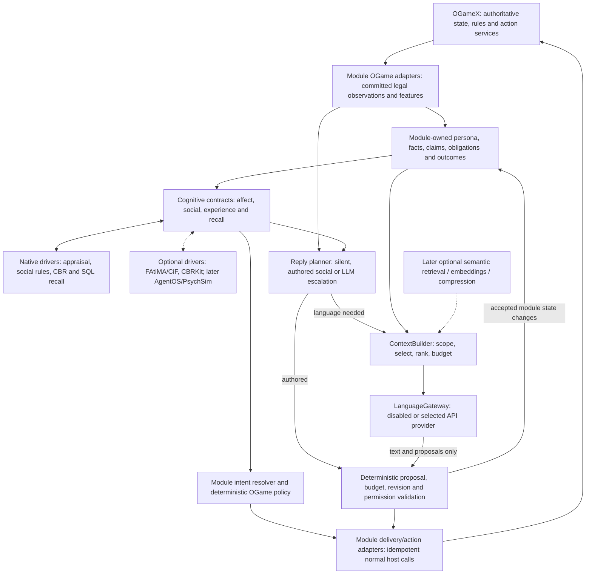

# Phase 3 — social cognition, experience and bounded conversation

Status: in progress. Slice 3A is implemented: committed inbound direct chat for enabled AI recipients is recorded in module-owned `ai_observations`, retaining source references but never raw chat text. Slice 3B now has typed fact/claim, sparse source-backed relationship and commitment lifecycle records; its remaining work is reducer integration and the full deletion/changed-membership acceptance matrix. Slice 3C is implemented: its native `AffectEngine`, persisted deterministic decay, and source-deduplicated significant emotional episodes retain bounded affect without changing factual state or commitments. Slice 3D is in progress with a persisted help-request protocol: native social cognition deterministically accepts, rejects, counters or clarifies from sparse relationship state, availability and outstanding commitments; an accepted response creates an exact accepted commitment, while authored text remains separate from execution. Slice 3E now has native owner-scoped finalized social-assistance cases and deterministic version-compatible similarity; its real host outcome correlation remains to be added with the delivery paths. Disabled enrichment remains deferred. This specification incorporates the agreed direction from [خيارات ذاكرة الذكاء الاصطناعي](chatgpt-conversation://6aa3a38a-0a34-83e9-aae1-dc75ed9ac709). The [decision record](../DECISIONS.md) resolves changes of direction in that discussion. Package 2 is recorded at module commit `e1c48a2`; its deterministic sessions are the starting point, not evidence that FAtiMA, CBR or social memory already exist.

Start with the [current-state assessment](../research/phase-3-current-state.md) and [decision history](../DECISIONS.md#phase-3-decision-history--11-september-2026), then use [memory and language](memory-and-language.md), [budgets](budgets.md), [validation](validation.md) and [driver evaluation](../research/memory-comparison.md) for their specific contracts. All class names and records below are implementation targets. They must be reconciled with the actual schema before writing migrations.

Run container-backed Phase 3 work only through the host repository's `local-docker-dev/` environment; do not create or use a second OGameX Docker stack.

## Player outcome and scope

An AI remembers who helped or harmed it, distinguishes a claim from an observed fact, honors or explicitly renegotiates agreements, learns from actual outcomes, and responds in its own voice. A request from a trusted ally can produce a different social response from the same request by a past betrayer. Anger can sustain a grudge while normal game policy still favors recovery over an unsafe attack.

Phase 3 adds these capabilities inside `Modules/AI`:

- Native observations, beliefs, relationships, commitments, conversation state and experience cases.
- Goal-aware appraisal, emotions, social importance, coping intentions and bounded emotional autobiography, using FAtiMA concepts and a replaceable implementation.
- CiF-style social exchanges and authored dialogue, including state and consequences across multiple turns.
- Case-based reasoning (CBR): retrieve, reuse, revise and retain outcome-backed experience without a generative model.
- A conversation escalation policy, compact context and one bounded LLM request when unrestricted language is useful.
- Module-owned contracts, native/disabled defaults, bounded external-driver verification and an evaluation harness.

Implement a useful vertical slice at a time. Do not extract a package, create a universal game framework, add a driver marketplace, invent a second scheduler, or reorganize Phase 2 merely to make future extraction easier. No external provider becomes the player runtime.

## Responsibility and state ownership

| Concern | Owner | Boundary |
| --- | --- | --- |
| Game truth, rules, resource costs, combat and execution | Existing OGameX services | AI policies use only legally observable inputs; cognition cannot grant a forbidden action. |
| Persona, observations, accepted beliefs/claims, relationships, commitments, current cognition state | AI module tables | One authoritative module record, with revisions and provenance; drivers cannot independently evolve personality. |
| Meaning of an event to this character | Affect/social driver | Proposes appraisal, bounded state changes and high-level intentions; the module validates and persists them. |
| Social interaction and response stance | Social-exchange policy/driver | Uses relationship, goals, mood, obligations and dialogue state to accept, reject, counter, clarify or stay silent. |
| What worked in comparable situations | Experience driver | Returns cases, similarity, uncertainty and outcome evidence; the ordinary policy decides how much weight to give them. |
| Relevant older personal history | Long-term memory driver | Returns scoped source references and recollections; native records establish their current truth and visibility. |
| Natural-language expression or interpretation | Language gateway | Returns text and bounded proposals. No tools, database handles, fleet commands or independent state writes. |
| Mapping intentions to OGame candidates | Module OGame adapters and existing policies | Reuse existing capability, legality and receipt paths. Unsupported capabilities remain explicit no-ops. |

The mental-state questions remain distinct: affect describes how the player feels; social cognition describes its desired interaction; experience describes prior outcomes; recall supplies supporting history. Their outputs are combined by module actions, not by having external providers invoke or synchronize each other.

## Small contracts inside the module

Use `Modules\AI\Contracts`, existing Domain areas, `Actions`, `Support`, `Jobs`, `Listeners`, models and module migrations. Add `Domain/Cognition` and `Domain/Conversation` only for these concrete responsibilities. Bind defaults in the existing `AIServiceProvider`; resolve managed collaborators using `app()` / `app()->makeWith()`. Keep actions descriptive and single-purpose. Do not add forwarding-only methods or a generic `CognitiveKernel` / `DriverManager`.

| Contract | Concrete operation to define | Initial implementation and replaceable seam |
| --- | --- | --- |
| `AffectEngine` | `appraiseObservedEvent`: permitted stimulus + persona + goals + prior affect → proposed appraisal/state revision and intentions | Native baseline; FAtiMA driver is the first external compatibility target. A disabled implementation preserves baseline gameplay. |
| `SocialCognition` | `evaluateSocialExchange`: scoped exchange, relationship, affect, obligations and dialogue state → ranked social responses with reasons | Native authored exchange rules; evaluate FAtiMA/CiF together through the same external cognition session. |
| `ExperienceEngine` | `rankSimilarExperiences`: query and authorized versioned case features → ranked outcome evidence with similarity/uncertainty | Native structured similarity baseline; optional CBRKit adapter. Native module actions own retrieval/retention so the driver cannot become the canonical case database. |
| `LongTermMemory` | `recallRelevantMemories`: scoped query and source-validity constraints → bounded evidence/recollections | Native SQL retrieval first; AgentOS cognitive-memory subset is an optional later candidate. Add projection index/removal operations only with an enabled driver that needs them; native facts remain independent of the index. |
| `LanguageGateway` | `generateConversationReply`: bounded authorized context + approved purpose + budget reservation → typed response and usage | Disabled default; its first enabled implementation uses the first-party Laravel AI SDK with one configured provider/model. The SDK is transport only: no tools, conversation-memory authority or game actions. See [Laravel AI SDK integration](laravel-ai-sdk.md). |
| `ContextBuilder` | `buildConversationContext`: scope, snapshot and per-section budget → selected source references and serialized context | Deterministic selection, ranking and trimming; never a generative call. |

These six boundaries have concrete Phase 3 callers; they are not separate packages or independent network processes. Keep internal policy, case persistence and native fact-reduction actions concrete unless a real replacement requires another contract. Native facts and authored social behavior cannot be null implementations; the no-language path is a real `NullLanguageGateway`. Optional affect/experience enrichment can return a typed disabled result for baseline/ablation tests without deleting state.

Do not scaffold `TheoryOfMind`, `Embedder`, `SemanticRetriever` or `ContextCompressor` interfaces/jobs until an approved experiment supplies a caller. Their future operations are respectively bounded social-response prediction, versioned text embedding, scoped candidate-ID retrieval and fitting older prose to a remaining budget. Initially those features are disabled; deterministic context selection/trimming is inside `ContextBuilder`. When a real optional driver is introduced, add a disabled/null implementation and conformance tests at the same time.

Keep affect separate from social interaction because event appraisal also serves non-chat recovery, while exchanges own multi-turn protocols and obligations. Keep experience separate from long-term recall because numeric outcome similarity and prose/history relevance have different inputs, evidence and acceptance tests. Keep language separate from context selection because provider behavior is nondeterministic/costed while ACL selection must remain inspectable and deterministic. Shared payloads and native stores eliminate duplicate truth without merging these responsibilities into one all-purpose engine.

If FAtiMA supplies both affect and social cognition, a single adapter session must advance its integrated character state once per event. Do not run two independent RolePlayCharacter states behind the two contracts. Provider adapters add value by translating data, checking scope/version, enforcing limits and mapping failures; they are not forwarding wrappers.

Driver-neutral payloads contain actor references, persona, goals, stimuli, beliefs, relationships, exchanges, experiences, intentions, timestamps and evidence IDs. They do not contain `PlanetService`, an Eloquent model, a database connection or a provider SDK object. Domain types and result/failure categories use enums and immutable value objects where practical. Suggested result categories include completed, unavailable, timed out, invalid, stale and budget exhausted; never encode failure as a successful empty state mutation.

### The OGame mapping remains concrete

`MapObservedGameEventToStimulusAction` translates a legally delivered battle loss into harm, responsibility, loss relative to the observer's assets, surprise and goal impact. It retains the exact report reference. The external driver sees an observed stimulus, not unrestricted battle tables.

`ExtractOGameExperienceFeaturesAction` derives bounded features such as observed power ratio, intel age, recent probe count, exposure, available support and recovery progress. Unknown enemy activity stays unknown. Feature definitions and their normalizers remain game-specific and versioned.

`ResolveCognitiveIntentAction` maps protect-self, seek-support, repair-relationship or retaliate intentions to existing OGame policy inputs/candidates. It must not create a universal executable `GameAction`. An intention to retaliate may lead to rebuilding or waiting; it does not authorize a fleet launch.

Read-only goal/belief projections supply progress, observed threat and available options to cognition. Where a driver supports computed beliefs, its adapter may expose allowlisted snapshot lookups, never arbitrary live database callbacks. Detailed build planning, fleet timing and resource math remain in their existing layers.

## Event-driven cognition

1. Observe an authorized, committed source and deduplicate it by scope, owner, source type and source ID.
2. Reduce it into typed facts/claims and determine whether it is emotionally significant, an experience outcome, a social exchange, or some combination.
3. Build a bounded revisioned snapshot and release the gameplay transaction/lock before any external work.
4. Ask only the relevant driver: routine construction does not need long-term recall or affect evaluation; a meaningful betrayal may need both.
5. Validate returned state changes against current source validity and the expected revision. Persist once, or discard/recompute stale results within a bounded retry policy.
6. Supply accepted intentions/evidence to the normal decision or reply planner. Revalidate at action/delivery time.

No periodic per-player cognition loop is added. Wake on legally observed meaningful events, messages, social decisions or completed outcomes. Deferred events are ordered by source time where available and the reducer's versioned ordering rule; late delivery must not silently replace newer truth.

The same source may yield distinct projections, such as an exact loss fact, an emotional episode and an outcome case. Record their shared source ID and different purposes. Do not copy the whole event stream into every provider. Recalling a belief is not a new observation, and private thoughts cannot become objective evidence through a provider feedback loop.

## Affect, goals and social importance

Preserve the useful integrated cognition concepts discussed in the conversation: goals, beliefs, appraisal, mood/emotions, social importance, emotional decision-making, coping, significant autobiography and dialogue state. Do not reduce the design to cosmetic emotion scores or assume that removing an integrated capability has no quality cost.

Appraisal considers goal desirability/obstruction, actor responsibility, predictability, perceived control, threat and relationship. Native calculations must name and version their scales, decay rules, limits and coefficients. Supply the clock and seeded randomness explicitly. The same event can create more fear for a cautious miner and more retaliatory intention for a vengeful fleeter while its factual content remains unchanged.

Persist affect and goal pressure separately from stable persona. Decay transient anger or distress with elapsed time; do not automatically forgive a debt or expire a valid commitment because an emotion fades. Keep only significant emotional episodes such as a costly betrayal, aid, a fulfilled/broken promise, expulsion or major loss. Their source facts remain independently retrievable.

FAtiMA is a candidate implementation of this capability, not an assertion that the native baseline reproduces the full toolkit. Compare the integrated driver against the baseline on actual behavior before selecting it. A failed compatibility spike must document the missing capability and fallback, rather than silently dropping it.

## Social exchanges and authored dialogue

Use explicit exchange types, preconditions, participants, terms, current step, allowed responses, expiry and accepted consequences. First cover greetings/thanks, resource/help requests, trade offers, ceasefire proposals, apologies, warnings/threats and cooperation requests. Later variants may reuse these primitives for alliance invitations, reminders, compensation and accusations of broken promises.

Each exchange evaluates trust, affinity, fear/threat, respect/social importance, relevant goals, unresolved obligations, previous interactions and available legal actions. A refusal, partial forgiveness or request for clarification is a valid outcome. Promises must have exact parties, terms and due conditions; an apology alone does not mark an obligation fulfilled.

Use authored lines with intent, tone, locale and allowed factual slots, seeded variant selection and repetition cooldowns. A known social exchange may be substantive and still need zero LLM calls. Deterministic recognition handles explicit structured messages and conservatively recognized language; ambiguous sarcasm, names, quantities or conditions must not be confidently guessed from a keyword.

AI-to-AI exchanges use typed messages and the same social rules. Render authored text only where a human can legitimately observe it. Bound exchange depth, pending proposals, retries and unsolicited traffic so automated agents cannot create an endless negotiation or public-chat loop.

## Experience learning without LLMs

Store a case as an observed situation, selected intention/action, ruleset/feature versions, actual outcome, uncertainty, utility components and supporting operation/report IDs. A decision without a completed outcome is pending, not a success. Failed and inconclusive attempts are retained when useful; avoid a success-only history.

1. **Retrieve:** filter by owner/authorized sharing, compatible ruleset, case family and feature version. Rank a bounded candidate set with named numeric/categorical similarity functions and missing-value handling.
2. **Reuse:** return evidence for existing options. Adapt only validated parameters within normal policy bounds; an old successful action cannot bypass today's resources, intel age or permissions.
3. **Revise:** correlate the real outcome with the decision/receipt. Separate predicted utility from realized benefit/loss and incomplete/confounded outcomes.
4. **Retain:** upsert once by source/outcome identity, update bounded statistics, and aggregate/archive repetitive cases with traceable provenance.

Personal experience is the default. Authored public seed cases and archetype-specific examples may be added as explicitly labeled knowledge with a ruleset/version; they must not expose other players' private histories. Do not secretly give every novice every veteran's experience. Compare novice/veteran and each persona with controlled cases.

Start with outcome families actually supported by durable sources and executable capabilities. Test social cooperation/trade outcomes and survival/recovery evidence as those paths become available; record-only fleet intents are not completed missions. Cold start, no close match, conflicting evidence or unavailable CBR returns control to the existing deterministic policy.

CBR contributes evidence when an interaction involves an actual decision. Greetings and routine acknowledgements do not retrieve cases. Generalized policy induction, executable skill generation and continuous model-based reflection are deferred research, not part of CBR's Phase 3 runtime.

## Conversation escalation

The reply planner chooses a typed route before reserving model capacity:

| Route | Situation | Generative requests |
| --- | --- | --- |
| Silent | Ignored/rate-limited sender, expired message, no useful response or insufficient confidence | 0 |
| Template | Greeting, acknowledgement or routine system-like response | 0 |
| Authored social dialogue | Known exchange; cognition selects stance and an adequate authored variant | 0 |
| LLM realization | Intent and permitted facts are settled; varied human-facing wording adds value | At most one bounded foreground request |
| LLM interpretation/reply | Ambiguous free-form human language needs interpretation and a proposed reply | At most one bounded foreground request, including any extraction |

For the ambiguous route, provide current cognition and allowed response constraints; the model proposes an interpretation, text and optional fact/commitment candidates together. Re-evaluate the interpreted exchange deterministically afterward. If the returned wording would promise something the validator rejects, replace it with an authored clarification/refusal or remain silent. Do not use an interpretation call followed by a second realization call to finish the same turn.

The complete receipt, context, delivery and coalescing contract is in [memory and language](memory-and-language.md). Budget limits and the distinction between coalescing, background work and provider Batch APIs are in [budgets](budgets.md).

## External drivers and ordinary Linux servers

Use the existing Laravel queue/database/container as the application runtime. An external driver may be a bounded headless sidecar owned and configured by the module. Do not spawn one process per AI player, require a GUI, or assume GPU/Kubernetes/vector infrastructure is needed for the native baseline.

The first compatibility targets are FAtiMA/CiF for integrated character cognition and CBRKit for structured experience. AgentOS is the selected candidate for richer long-term recall when needed; use only its memory services. PsychSim is later, bounded Theory of Mind. Exact project identities, pinned versions, licenses, supported runtime/API and deployment requirements must be verified from primary sources in the spike; claims in the imported chat are not verified installation results.

For every enabled driver: define connect/request timeouts, payload/candidate limits, concurrency cap, health checks, circuit breaker, revision/idempotency handling and a tested native/disabled fallback. Do not keep player-specific mutable state in an unscoped Laravel singleton. External state changes must be idempotent or recoverable; no retry may reapply the same appraisal as a new experience.

Export canonical state with module IDs/schema versions. Rebuild disposable indexes from authorized projections. Swapping a driver must not reset persona, trust, active agreements or history. If an external cognitive checkpoint cannot be translated, rebuild from a compatible module snapshot and record the capability/behavior change; never claim bit-identical behavior across different engines.

Run compatibility work as one focused spike per selected driver, not another broad product search. Pass: a pinned headless Linux implementation completes a realistic contract scenario and outage/swap test. Fail: record the exact blocker, retain the tested baseline and leave that driver disabled. Report feature gaps honestly. No package or host dependency is added by this planning revision.

### Configuration and state lifetimes

Keep driver configuration in the module: selected affect/social/experience/memory/language implementations, enabled capabilities, timeouts, bounded payload/history sizes, queue concurrency, feature versions and experiment cohort. Secrets remain environment configuration, never persona settings or traces. Default to native cognition/social/experience/memory and disabled language; explicit operator configuration enables one language provider. Optional embeddings, ML compression, Theory of Mind, advanced memory and strategic advice start disabled.

Validate supported driver combinations at boot without eagerly connecting to absent optional sidecars. An unknown/misconfigured enabled driver must produce a visible configuration failure and defined native/disabled fallback. Record the selected configuration and revisions in experiment traces. Changing a driver must invalidate incompatible cached projections/checkpoints while preserving canonical facts, persona and obligations.

Module-owned data is durable: exact observations/claims, persona, accepted affect/social state, commitments, case outcomes, message source IDs and usage receipts. A cognition driver may keep an implementation-specific checkpoint as a versioned projection for performance; an experience driver may cache a case index; long-term memory may cache/index approved episodes. Conversation bodies remain in the host's normal chat storage where available, with module-owned ACL/revision/proposal metadata. Avoid a second unbounded raw-message archive.

### Failure and degradation contract

| Failure | Degradation | State and retry behavior |
| --- | --- | --- |
| FAtiMA/affect-social sidecar unavailable | Use native affect/social rules and authored dialogue; normal recovery/utility policy proceeds | Use canonical module state; reject partial or stale external updates. Record degraded mode and bounded circuit-breaker recovery. Do not reset emotion/persona or apply the same appraisal twice. |
| AgentOS/advanced recall unavailable | Use native scoped facts, obligations and recent/significant episodes | Projection work may retry in bounded outbox jobs; no private-state dump into the LLM as compensation. |
| CBRKit/experience driver unavailable | Use native structured similarity where configured, otherwise existing utility policy with no experience bonus | Retain finalized real cases locally for later indexing. Missing advice is not a failed gameplay action. |
| Embeddings/index unavailable | Entity/time/full-text/native retrieval | Mark projection version pending; do not mix vector spaces or trigger an unbudgeted hosted model. |
| LLM unavailable, invalid, over budget or too slow | Authored response, bounded clarification, defer within TTL or silence | Keep ordinary gameplay and structured exchanges running. Account for every attempted request; uncertain calls require reconciliation before retry. |
| Optional compression/ToM unavailable | Deterministic context trimming / baseline social evaluation | No mandatory enrichment or second LLM fallback. |
| Canonical database unavailable | Ordinary database/job failure handling; defer state-dependent work | Native truth cannot be fabricated. Provider fallback does not solve lost authoritative storage; report and retry safely when it returns. |

## Eight end-to-end flows

Generative counts below describe the normal request path. A transport retry is a separately recorded attempt under the shared cap; it is never an extra reasoning/extraction stage. In every flow, deterministic module policy authorizes social/behavioral consequences and only existing OGameX domain services can execute an actual game action.

### 1. Routine human greeting

Receive/reload authorized chat → deduplicate/rate limit → recognize greeting → choose a seeded authored variant → permission recheck → normal chat send. LLM calls: **0**. Persist source/conversation position and a delivery receipt; create a relationship only if policy considers this meaningful contact. No fleet/resource action occurs.

### 2. Structured trade proposal

Read explicit parties, quantities, units and deadline → consult current permitted resources, relationship, obligations and optional relevant outcome cases → social policy chooses reject, counter or an authorized proposal → authored response. LLM calls: **0**. Persist the exchange, exact proposed/accepted terms and source; fulfillment is recorded only from a real correlated transport/outcome. If no validated executable trade/transport adapter exists, do not promise a completed delivery: record unsupported capability and decline or clarify. Adding any needed narrow module adapter first requires human-path equivalence tests; the social engine never creates fleets.

### 3. Apology after prior betrayal

Recognize the known apology → native recall loads the betrayal and any later successful trades with source IDs → affect/social cognition weighs current anger, trust, goals and obligation state → accept, partially forgive, request compensation or reject → authored text. LLM calls: **0** for a confidently recognized exchange; richer wording may independently choose the realization route with **1** bounded call. Persist the apology, accepted relationship/appraisal changes and exchange result. Do not delete the betrayal or mark a debt fulfilled merely because an apology was accepted.

### 4. Complicated free-form human negotiation

“Leave your alliance before reset and I will arrange protection until Sunday if you pay half your production” → ambiguous route → scoped context with current cognition, exact known obligations and permitted choices → **1** combined interpretation/reply request → deterministic validation of proposed conditions, actors and intent → send only compatible text, otherwise authored clarification. Persist attributed claims and validated proposals; no raw trust delta or promise is automatically applied. Existing policy must approve any later commitment/action, and an unsupported alliance/transport capability cannot be invented by the reply.

### 5. AI-to-AI social interaction

One AI sends a typed help/cooperation proposal → recipient's social policy evaluates trust, goals, obligations and relevant experience → typed accept/reject/counter response with bounded protocol depth. LLM calls: **0**, including any public rendering. Persist exchange/commitment transitions and authorized social evidence once. Authored text may be sent through normal chat when a human may see it. Any actual assistance still uses an existing validated OGame action adapter.

### 6. Major fleet loss

AI legally receives a committed correlated battle report → native reducer records the loss → appraisal updates distress/fear/anger and goal pressure → finalized outcome updates CBR → existing utility policy chooses available recovery/safety behavior. Baseline LLM calls: **0**. A later explicitly enabled rare-advice experiment may make **1** separately budgeted advisory request without delaying recovery; it cannot dispatch a fleet. Persist the exact fact, significant emotional episode, outcome case and accepted intentions, all linked to the same source. A record-only fleet intent is never used as proof that a battle happened.

### 7. Retrieve an old human-conversation memory

Human refers to an old encounter → exact entity/time/fact retrieval first → if an enabled, benchmark-qualified advanced memory/semantic driver is relevant, request bounded candidate IDs → recheck native visibility, deletion, source attribution and current validity → select a few records for context. Retrieval uses **0 generative calls**; optional embeddings are metered separately. Authored output uses **0**, while unrestricted reply generation uses **1**. A recalled claim remains attributed and does not create a new fact merely by being retrieved. Only conversation/delivery metadata or explicitly bounded retention bookkeeping is written.

### 8. LLM provider failure

The planner reserves a request → provider attempt fails or returns invalid output → record actual/uncertain usage and failure → choose authored clarification, defer-with-expiry or silence → continue scheduled gameplay independently. Generative attempts: **1** if dispatched, **0** if the circuit breaker/cap refused dispatch. A safe retry, if allowed, is one further counted attempt and cannot bypass the global cap. Persist the request/usage state and any delivered fallback receipt; do not persist unvalidated model proposals or clear memory. No game action depends on the provider succeeding.

## Later capabilities and explicit activation gates

| Capability | Placement and condition |
| --- | --- |
| AgentOS enhanced recall | Optional Phase 3 follow-on/Phase 4 experiment after native retrieval measurements. No agent runtime, tools, autonomous personality, LLM extraction/derive/reflection/HyDE. Verify zero generative requests for the chosen memory configuration. |
| Semantic embeddings | Enable for long conversational prose only after measured native retrieval misses. Prefer a suitably licensed local English/Arabic model; scope/filter results against canonical facts. No mandatory embedding API or dedicated vector database choice yet. |
| ML prompt compression | Consider only after selection, section budgets and semantic selection prove insufficient. Only older prose is eligible; instructions, current turn, exact terms and provenance remain intact. |
| PsychSim | Optional advanced diplomacy/coalition reasoning after baseline social quality is measured. Start with self plus 1–3 counterparts, depth 1, at most depth 2 only after profiling, a small choice set and a hard deadline. No per-tick invocation. |
| Rare strategic LLM advice | Optional post-baseline Phase 3+ experiment, disabled by default. Eligible major events: fleet loss, war declaration, repeated attacks, alliance conflict, new colony or major rank change. Trigger alone is insufficient: require a material unresolved decision, event dedupe, cooldown and an explicit budget. Existing policy responds immediately; validated advice may influence later planning only. |
| Deferred provider batches / learning summaries | Preserve as a future experiment for explicitly selected meaningful conversation episodes or outcome clusters. Idle time or 50 accumulated cases does not itself authorize an LLM call. No automatic per-event summarization or periodic reflection. See the opt-in gate in [budgets](budgets.md). |
| Framework extraction / community drivers | Revisit only after a real implementation swap works without changing OGame domain code and contracts remain stable in use. A second real consumer would strengthen the evidence. No package split or generic game integration layer in Phase 3. |

Phase 5 reuses accepted persona, social, experience and language boundaries for faction cooperation. It does not add a second AI brain or unlock AI-to-AI LLM chatter.

## Delivery slices and completion evidence

| Slice | Concrete deliverable | Required proof before moving on |
| --- | --- | --- |
| 3A — source audit and observations | **Implemented:** direct inbound chat observations, post-commit reduction, deduplication and bounded legal reconciliation. | Feature coverage for rollback, duplicate, late-source and recipient isolation; no external dependency. |
| 3B — facts and obligations | **In progress:** native fact/claim, sparse source-backed relationships, and exact commitment lifecycle records with provenance, retrieval and claim expiry. Reducer integration and the full deletion/changed-membership matrix remain. | Attributed gossip, changed membership, exact terms, fulfilled/expired debt and deletion cases. |
| 3C — native affect | **Implemented:** native `AffectEngine` performs bounded, persona-sensitive aid, threat and harm appraisal; persisted state decays deterministically, while source-deduplicated significant emotional episodes preserve important events independently of transient state. Disabled enrichment remains deferred. | Same evidence differs meaningfully by persona; state/decay/restart remain deterministic. |
| 3D — social protocols | **In progress:** `SocialCognition`, a source-deduplicated direct help-request protocol, persisted response state, native authored variants and accepted commitment linkage. Other exchange families and the betrayal/apology matrix remain. | Accept/reject/counter/clarify, betrayal/apology, outstanding obligations and bounded AI-to-AI protocol tests. |
| 3E — outcome experience | **In progress:** native `ExperienceEngine` retains finalized, owner-scoped social-assistance outcomes once and ranks compatible cases with deterministic numeric/categorical similarity. Correlation to a completed host operation remains. | Actual outcome changes evidence; cold start, unknown features, failed cases, stale versions and duplicate retention. |
| 3F — authored human delivery | **In progress:** an enabled AI can send a bounded direct authored reply through `ChatService` only after recipient, self-message, ignore and reply-to conversation checks. Pending replies/coalescing and idempotent crash reconciliation remain. | Real host persistence, ignore/membership changes, stale reply generation, duplicate send and crash reconciliation. LLM still disabled. |
| 3G — context and usage | **In progress:** native owner-scoped fact recall and deterministic bounded context selection are implemented. Provenance-rich sections and the atomic reservation ledger remain. | Scoped/provenance-preserving context; protected-content overflow and concurrent cap tests. No provider needed. |
| 3H — optional language | `LanguageGateway`, disabled implementation and a Laravel AI SDK adapter over one selected provider/model; combined proposals and validation | One-request semantics, SDK fake plus real adapter tests, invalid/truncated output, outage and usage reconciliation; opt-in quality evaluation. Follow [Laravel AI SDK integration](laravel-ai-sdk.md). |
| 3I — external experiments | Separate focused PR/spike for FAtiMA/CiF or CBRKit after its native boundary works | Real headless driver conformance, disable/swap and measured comparison; record fallback/gaps if a candidate fails. No mandatory sidecar to finish the native slice. |
| 3J — acceptance and measurement | Complete scenario/ablation harness, export/delete tests, 100/500/1,000 registered-player load experiments and driver decision records | Required baseline works with all optional services absent; every enabled real driver has supported-operation and replacement evidence. |

Complete Phase 3 when the required native/social/experience/conversation slices and their behavioral tests pass, enabled drivers meet their conformance gates, and optional failures/deferments are recorded. Do not claim completion because interfaces exist, line coverage is high, or a sidecar starts. Persist provider-off evidence that normal gameplay, structured memory, known social exchanges and authored replies remain useful.

Use native Pest 5 datasets across personas, skill levels, relationships, exchange types and failure conditions; PAO and PCOV, never Xdebug or Mockery. Contract replacement tests complement real module/host paths. [Validation](validation.md) defines the concrete matrix and separation between reproducible tests and model-quality evaluations.

## Final architecture

All boxes below are inside the AI module except OGameX services and explicitly optional external processes/providers. “Generic” describes the contract vocabulary, not a new framework package. Solid flows carry scoped data or validated intent; optional drivers supply proposals/evidence. The deterministic policy and normal OGameX services retain final authority.

